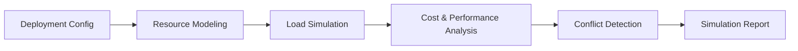

# Deploy Simulator

Deploy Simulator models cloud deployment scenarios to predict infrastructure behavior before actual provisioning. It helps teams validate architecture decisions, estimate costs, and identify potential failures in a risk-free environment.

## Features

- Infrastructure Modeling: Define resources, networking, and dependencies in a sandboxed simulation
- Scaling Simulation: Test auto-scaling policies under projected traffic patterns and load profiles
- Cost Projection: Generate deployment-specific cost estimates across reserved, on-demand, and spot pricing
- Conflict Detection: Identify naming conflicts, IP overlaps, region restrictions, and quota limits
- What-If Analysis: Compare multiple deployment strategies with side-by-side simulation results

## Workflow

## Usage

View the full documentation on GitHub: [Tool Directory](https://github.com/kleinnner/Anticloud/tree/main/12-api-oss-tools/deploy-simulator)

## Related Tools

- [Deployment Cost Estimator](../analysis/deployment-cost-estimator)
- [Architecture Canvas](../analysis/architecture-canvas)
- [Integration Checker](../analysis/integration-checker)
