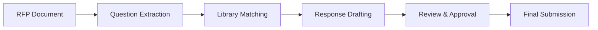

# RFP Response

RFP Response streamlines the creation of responses to Requests for Proposals in the cloud and security space. It maintains a library of pre-approved answers, maps responses to evaluation criteria, and tracks submission deadlines.

## Features

- Answer Library: Curated repository of pre-written responses for common cloud and security questions
- Criteria Mapping: Align responses to RFP evaluation criteria with weighted scoring visibility
- Collaboration Tools: Real-time co-authoring with comments, approvals, and version history
- Compliance Cross-Reference: Automatically reference SOC 2, ISO 27001, and FedRAMP controls in responses
- Submission Management: Track deadlines, reviewers, and submission status across active RFPs

## Workflow

## Usage

View the full documentation on GitHub: [Tool Directory](https://github.com/kleinnner/Anticloud/tree/main/12-api-oss-tools/rfp-response)

## Related Tools

- [Contract Clause Analyzer](../analysis/contract-clause-analyzer)
- [Vendor Risk Score](../compliance/vendor-risk-score)
- [Capability Matrix](../compliance/capability-matrix)
