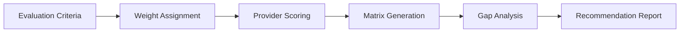

# Capability Matrix

The Capability Matrix provides a structured framework for evaluating and comparing cloud services, tools, and vendors against customizable criteria. It helps teams make data-driven decisions during architecture and procurement processes.

## Features

- Custom Criteria: Define your own evaluation dimensions with weighted scoring
- Provider Comparison: Side-by-side scoring of AWS, Azure, GCP, and other providers
- Security Mapping: Map capabilities against compliance frameworks like SOC 2, ISO 27001, and FedRAMP
- Gap Visualization: Color-coded heat maps highlight strengths and weaknesses across categories
- Exportable Reports: Download comparison matrices as PDF, CSV, or embedded HTML

## Workflow

## Usage

View the full documentation on GitHub: [Tool Directory](https://github.com/kleinnner/Anticloud/tree/main/12-api-oss-tools/capability-matrix)

## Related Tools

- [Vendor Risk Score](../compliance/vendor-risk-score)
- [Compliance Checklist](../compliance/compliance-checklist)
- [Architecture Canvas](../analysis/architecture-canvas)
