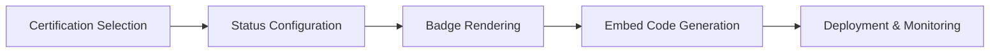

# Cert Badges

Cert Badges creates visual certification badges that display your organization's current compliance posture. These badges can be embedded in dashboards, websites, and reports to communicate trust and regulatory alignment.

## Features

- Badge Library: Pre-designed badges for SOC 2, ISO 27001, FedRAMP, HIPAA, GDPR, and PCI DSS
- Status Indicators: Dynamic badges show active, expiring, expired, or in-audit certification states
- Embeddable Widgets: Generate HTML and markdown snippets for website and documentation integration
- Expiration Tracking: Automatic countdown indicators with renewal reminder notifications
- Custom Branding: Apply organization colors, logos, and typography to badge designs

## Workflow

## Usage

View the full documentation on GitHub: [Tool Directory](https://github.com/kleinnner/Anticloud/tree/main/12-api-oss-tools/cert-badges)

## Related Tools

- [Compliance Checklist](../compliance/compliance-checklist)
- [SSP Generator](../compliance/ssp-generator)
- [Supply Chain SBOM](../compliance/supply-chain-sbom)
