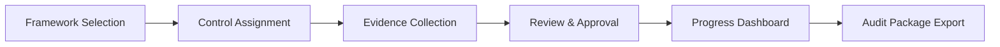

# Compliance Checklist

Compliance Checklist provides an interactive checklist system for managing regulatory and framework compliance. It organizes requirements by control family, tracks completion status, and collects evidence for audit readiness.

## Features

- Framework Libraries: Built-in checklists for SOC 2, ISO 27001, NIST 800-53, CIS Benchmarks, and HIPAA
- Progress Tracking: Visual completion indicators with per-category breakdowns and trends
- Evidence Attachment: Upload screenshots, documents, and logs as proof of control implementation
- Assignment Workflow: Assign checklist items to team members with due dates and notifications
- Audit Export: Generate auditor-ready evidence packages in PDF and ZIP formats

## Workflow

## Usage

View the full documentation on GitHub: [Tool Directory](https://github.com/kleinnner/Anticloud/tree/main/12-api-oss-tools/compliance-checklist)

## Related Tools

- [Compliance Gap Analyzer](../compliance/compliance-gap-analyzer)
- [Compliance Generator](../compliance/compliance-generator)
- [Vendor Risk Score](../compliance/vendor-risk-score)
