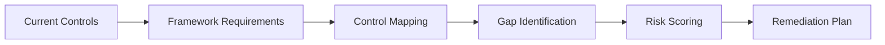

# Compliance Gap Analyzer

The Compliance Gap Analyzer compares your existing security posture against the requirements of one or more compliance frameworks. It produces a prioritized gap list with actionable remediation steps mapped to specific controls.

## Features

- Framework Comparison: Map current controls against SOC 2, ISO 27001, NIST, CIS, and FedRAMP
- Automated Mapping: AI-assisted control mapping from existing documentation and configurations
- Gap Scoring: Each gap is scored by risk impact, implementation effort, and regulatory priority
- Remediation Roadmap: Generate sequenced action plans with estimated effort and owner assignment
- Delta Tracking: Re-run analysis after remediation to visualize progress over time

## Workflow

## Usage

View the full documentation on GitHub: [Tool Directory](https://github.com/kleinnner/Anticloud/tree/main/12-api-oss-tools/compliance-gap-analyzer)

## Related Tools

- [Compliance Checklist](../compliance/compliance-checklist)
- [Compliance Generator](../compliance/compliance-generator)
- [Threat Model](../security/threat-model)
