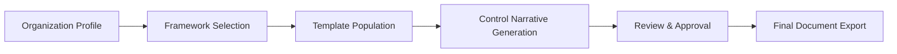

# Compliance Generator

The Compliance Generator automates the creation of compliance documentation from structured inputs. It produces control narratives, policy documents, and evidence descriptions that align with major regulatory frameworks.

## Features

- Policy Templates: Pre-written policy and procedure templates for 50+ common compliance domains
- Control Narratives: Generate detailed control descriptions with implementation context and ownership
- Framework Mapping: Documents are automatically cross-referenced to framework control IDs
- Customization Engine: Tailor generated content with organization-specific details and branding
- Version Control: Track document revisions with changelogs and approval workflows

## Workflow

## Usage

View the full documentation on GitHub: [Tool Directory](https://github.com/kleinnner/Anticloud/tree/main/12-api-oss-tools/compliance-generator)

## Related Tools

- [SSP Generator](../compliance/ssp-generator)
- [Compliance Checklist](../compliance/compliance-checklist)
- [Data Residency Map](../compliance/data-residency-map)
