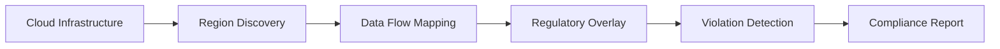

# Data Residency Map

Data Residency Map provides a geographic visualization of your data storage, processing, and transit paths. It ensures compliance with data sovereignty requirements by identifying cross-border data flows and region-specific regulatory obligations.

## Features

- Geographic Visualization: Interactive world map showing data centers, regions, and data flow paths
- Regulatory Overlay: Display GDPR, CCPA, LGPD, PIPEDA, and other data law boundaries on the map
- Flow Detection: Automatically identify data transfer between regions from cloud provider configurations
- Restriction Alerts: Flag data movements that violate residency requirements or transfer agreements
- Compliance Reporting: Generate data sovereignty reports for regulatory submissions and audits

## Workflow

## Usage

View the full documentation on GitHub: [Tool Directory](https://github.com/kleinnner/Anticloud/tree/main/12-api-oss-tools/data-residency-map)

## Related Tools

- [Privacy Scanner](../utilities/privacy-scanner)
- [Compliance Gap Analyzer](../compliance/compliance-gap-analyzer)
- [Data Local Score](../utilities/data-local-score)
