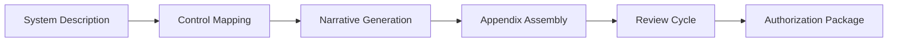

# SSP Generator

The SSP Generator streamlines the creation of System Security Plans required for FedRAMP, SOC 2, and other certification frameworks. It assembles control implementation narratives, diagrams, and appendices into a coherent authorization package.

## Features

- Framework Templates: Pre-built SSP structures for FedRAMP Low, Moderate, High, and SOC 2 Type II
- Control Narratives: Guided questionnaires that generate complete implementation descriptions
- Diagram Integration: Embed architecture diagrams and data flow illustrations within control descriptions
- Appendix Assembly: Automatically generate required appendices including POA&M and continuous monitoring
- Package Export: Produce complete Word, PDF, and HTML authorization packages with table of contents

## Workflow

## Usage

View the full documentation on GitHub: [Tool Directory](https://github.com/kleinnner/Anticloud/tree/main/12-api-oss-tools/ssp-generator)

## Related Tools

- [Compliance Generator](../compliance/compliance-generator)
- [Compliance Checklist](../compliance/compliance-checklist)
- [Capability Matrix](../compliance/capability-matrix)
