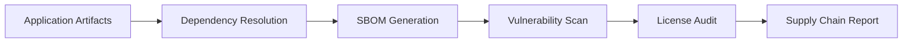

# Supply Chain SBOM

Supply Chain SBOM manages software bill of materials for your cloud-native applications. It generates SBOMs in industry-standard formats, validates them against known vulnerability databases, and tracks component provenance across the software supply chain.

## Features

- SBOM Generation: Create SPDX 2.3 and CycloneDX 1.5 SBOMs from container images, packages, and repos
- Vulnerability Correlation: Cross-reference components against OSV, NVD, and GitHub Advisory Database
- License Compliance: Detect conflicting or restricted licenses across dependencies
- Provenance Tracking: Capture build-time metadata and source repository information for each component
- Diff Analysis: Compare SBOM versions to identify added, removed, or updated components

## Workflow

## Usage

View the full documentation on GitHub: [Tool Directory](https://github.com/kleinnner/Anticloud/tree/main/12-api-oss-tools/supply-chain-sbom)

## Related Tools

- [Vendor Risk Score](../compliance/vendor-risk-score)
- [Integration Checker](../analysis/integration-checker)
- [Compliance Checklist](../compliance/compliance-checklist)
