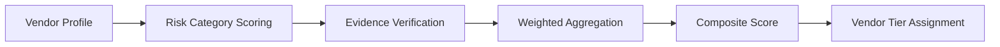

# Vendor Risk Score

Vendor Risk Score provides a structured framework for evaluating third-party vendors and partners. It aggregates risk signals across multiple domains to produce a composite risk score that informs vendor selection and oversight decisions.

## Features

- Risk Dimensions: Score vendors across security, privacy, compliance, financial, and operational categories
- Questionnaire Integration: Send and score vendor security questionnaires with automated analysis
- Evidence Collection: Request and verify vendor documentation including SOC reports and penetration tests
- Dynamic Scoring: Automatically update scores based on breach notifications, news, and certification changes
- Portfolio View: Dashboard showing risk distribution across the entire vendor ecosystem

## Workflow

## Usage

View the full documentation on GitHub: [Tool Directory](https://github.com/kleinnner/Anticloud/tree/main/12-api-oss-tools/vendor-risk-score)

## Related Tools

- [Capability Matrix](../compliance/capability-matrix)
- [Supply Chain SBOM](../compliance/supply-chain-sbom)
- [Compliance Gap Analyzer](../compliance/compliance-gap-analyzer)
