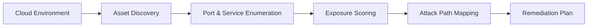

# Attack Surface Analyzer

The Attack Surface Analyzer systematically discovers, catalogues, and evaluates every externally reachable component in your cloud infrastructure. It helps security teams identify misconfigurations, exposed services, and potential entry points before attackers do.

## Features

- Asset Discovery: Automatically enumerates cloud resources, endpoints, and subdomains across providers
- Exposure Scoring: Assigns risk ratings to each discovered asset based on port, protocol, and accessibility
- Attack Path Mapping: Visualizes how an attacker could pivot between exposed components
- Continuous Monitoring: Re-scans on configurable schedules to detect drift and new exposures
- Remediation Guidance: Provides actionable steps to reduce or eliminate each identified risk

## Workflow

## Usage

View the full documentation on GitHub: [Tool Directory](https://github.com/kleinnner/Anticloud/tree/main/12-api-oss-tools/attack-surface)

## Related Tools

- [Threat Model](../security/threat-model)
- [Credential Vault](../security/credential-vault)
- [Compliance Checklist](../compliance/compliance-checklist)
