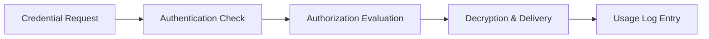

# Credential Vault

The Credential Vault provides a centralized, encrypted repository for managing sensitive credentials across your cloud infrastructure. It integrates with CI/CD pipelines and runtime environments to eliminate hard-coded secrets.

## Features

- Encrypted Storage: All secrets are encrypted at rest using AES-256-GCM with automatic key rotation
- Access Policies: Role-based and attribute-based access controls for fine-grained secret distribution
- Secret Rotation: Automated rotation schedules with zero-downtime credential updates
- Audit Logging: Every access and modification is timestamped and attributed to a principal
- API Integration: REST and SDK interfaces for programmatic secret retrieval and management

## Workflow

## Usage

View the full documentation on GitHub: [Tool Directory](https://github.com/kleinnner/Anticloud/tree/main/12-api-oss-tools/credential-vault)

## Related Tools

- [Secure Random](../security/secure-random)
- [Encrypt Text](../security/encrypt-text)
- [Attack Surface Analyzer](../security/attack-surface)
