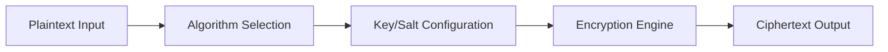

# Encrypt Text

Encrypt Text provides a lightweight utility for applying cryptographic transformations to text data directly in your browser or CLI. It supports multiple symmetric and asymmetric algorithms for ad-hoc encryption needs.

## Features

- Multi-Algorithm Support: AES-256, ChaCha20, RSA-OAEP, and elliptic curve encryption
- Key Management: Generate, import, or derive encryption keys from passphrases
- Encoding Options: Output as Base64, Hex, or binary with configurable character sets
- Clipboard Integration: One-click copy of encrypted output or decrypted plaintext
- Offline Operation: All encryption happens locally with no data sent to external servers

## Workflow

## Usage

View the full documentation on GitHub: [Tool Directory](https://github.com/kleinnner/Anticloud/tree/main/12-api-oss-tools/encrypt-text)

## Related Tools

- [Secure Random](../security/secure-random)
- [Hash Checker](../security/hash-checker)
- [Credential Vault](../security/credential-vault)
