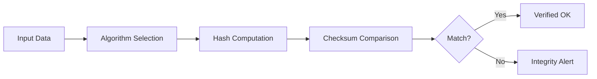

# Hash Checker

Hash Checker computes cryptographic hashes for files, text, or binary data and compares them against known or user-supplied values. It is essential for verifying download integrity, audit trail consistency, and data deduplication.

## Features

- Algorithm Support: SHA-1, SHA-256, SHA-512, MD5, BLAKE2b, and BLAKE3
- File & Text Mode: Hash entire files or arbitrary text strings with drag-and-drop support
- Integrity Verification: Compare computed hash against a provided checksum with match highlighting
- Checksum File Parsing: Import and validate against .sha256, .md5, and .sfv checksum files
- Batch Processing: Hash multiple files simultaneously with tabular results exportable to CSV

## Workflow

## Usage

View the full documentation on GitHub: [Tool Directory](https://github.com/kleinnner/Anticloud/tree/main/12-api-oss-tools/hash-checker)

## Related Tools

- [Encrypt Text](../security/encrypt-text)
- [Ledger Verifier](../security/ledger-verifier)
- [Secure Random](../security/secure-random)
