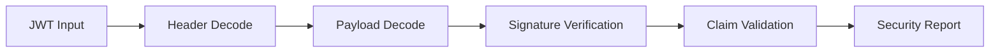

# JWT Inspector

JWT Inspector is a developer-facing tool for decoding and examining JSON Web Tokens without sending data to a server. It validates signatures, inspects claims, and flags common security issues in token implementations.

## Features

- Token Decoding: Base64-decodes header and payload with formatted JSON display
- Signature Verification: Validates tokens using HS256, RS256, ES256, and other algorithms
- Claim Analysis: Checks for standard claims (exp, iat, iss, sub, aud) and reports expiration status
- Security Audits: Detects weak algorithms, missing expiration, and common JWT vulnerabilities
- Payload Editing: Modify claims and re-encode tokens for testing and debugging workflows

## Workflow

## Usage

View the full documentation on GitHub: [Tool Directory](https://github.com/kleinnner/Anticloud/tree/main/12-api-oss-tools/jwt-inspector)

## Related Tools

- [Hash Checker](../security/hash-checker)
- [Secure Random](../security/secure-random)
- [Encrypt Text](../security/encrypt-text)
