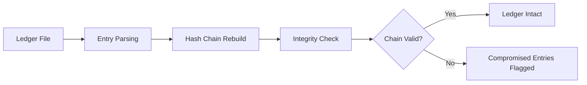

# Ledger Verifier

Ledger Verifier cryptographically validates the integrity of sequential log entries or ledger records. By chaining hashes across entries, it detects any tampering, insertion, or deletion within historical records.

## Features

- Hash Chain Validation: Recomputes and verifies the linked hash chain across all ledger entries
- Tamper Detection: Identifies the exact position and nature of any data modification
- Merkle Tree Support: Validates Merkle proofs for selective entry verification
- Multiple Ledger Formats: Supports JSON, CSV, plaintext, and structured log formats
- Batch Verification: Processes thousands of entries per second with progress reporting

## Workflow

## Usage

View the full documentation on GitHub: [Tool Directory](https://github.com/kleinnner/Anticloud/tree/main/12-api-oss-tools/ledger-verifier)

## Related Tools

- [Hash Checker](../security/hash-checker)
- [Attack Surface Analyzer](../security/attack-surface)
- [Data Residency Map](../compliance/data-residency-map)
