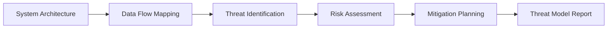

# Threat Model

Threat Model guides security teams through structured threat modeling exercises using industry-standard frameworks. It produces data-flow diagrams, trust boundaries, and prioritized threat lists to inform security architecture decisions.

## Features

- Framework Selection: Choose between STRIDE, PASTA, LINDDUN, or custom threat taxonomies
- Data Flow Diagrams: Build interactive architectural diagrams with trust boundary annotations
- Threat Catalog: Browse a built-in library of common threats mapped to mitigation patterns
- Risk Scoring: Rate threats by likelihood and impact with automatic priority ranking
- Report Export: Generate PDF or markdown threat model reports for compliance and review

## Workflow

## Usage

View the full documentation on GitHub: [Tool Directory](https://github.com/kleinnner/Anticloud/tree/main/12-api-oss-tools/threat-model)

## Related Tools

- [Attack Surface Analyzer](../security/attack-surface)
- [Compliance Gap Analyzer](../compliance/compliance-gap-analyzer)
- [Architecture Canvas](../analysis/architecture-canvas)
