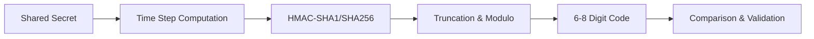

# TOTP Generator

TOTP Generator implements RFC 6238 and RFC 4226 for time-based and HMAC-based one-time passwords. It can generate TOTP codes from shared secrets, validate submitted tokens, and produce provisioning URIs for authenticator apps.

## Features

- Code Generation: Produce TOTP codes for any time step and key length per RFC 6238
- HOTP Support: Generate HMAC-based one-time passwords with configurable counter values
- QR Provisioning: Create QR codes containing standard otpauth:// URIs for mobile apps
- Time Drift Tolerance: Validate codes within a configurable window of time steps
- Batch Generation: Generate multiple sequential codes for testing synchronization

## Workflow

## Usage

View the full documentation on GitHub: [Tool Directory](https://github.com/kleinnner/Anticloud/tree/main/12-api-oss-tools/totp-generator)

## Related Tools

- [Secure Random](../security/secure-random)
- [Credential Vault](../security/credential-vault)
- [Encrypt Text](../security/encrypt-text)
