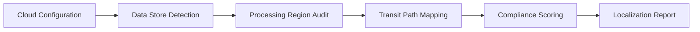

# Data Local Score

Data Local Score evaluates how well your cloud application adheres to data localization requirements. It analyzes storage locations, processing regions, and data transit paths to produce a localization compliance score.

## Features

- Storage Analysis: Identify geographic locations of all primary and replica data stores
- Processing Audit: Track where data transformations and computations occur across regions
- Transit Mapping: Map data movement between regions with focus on cross-border transfers
- Compliance Scoring: Score each data flow against GDPR, CCPA, LGPD, and local data laws
- Optimization Recommendations: Suggest configuration changes to improve data locality

## Workflow

## Usage

View the full documentation on GitHub: [Tool Directory](https://github.com/kleinnner/Anticloud/tree/main/12-api-oss-tools/data-local-score)

## Related Tools

- [Data Residency Map](../compliance/data-residency-map)
- [Privacy Scanner](../utilities/privacy-scanner)
- [Compliance Gap Analyzer](../compliance/compliance-gap-analyzer)
