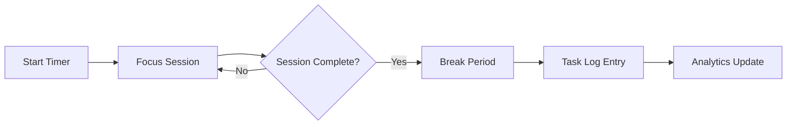

# Focus Timer

Focus Timer implements the Pomodoro Technique and other time management methods to help developers maintain deep focus during complex cloud engineering tasks. It tracks work sessions, logs distractions, and provides productivity analytics.

## Features

- Pomodoro Timer: Configurable focus and break intervals with auto-rotation
- Task Tracking: Associate timer sessions with specific tasks or tickets for time accounting
- Distraction Log: Quick-capture button to log interruptions with optional context notes
- Session History: Browse past sessions by day, project, or task with duration summaries
- Productivity Analytics: Visualize daily focus time, task completion rates, and trend charts

## Workflow

## Usage

View the full documentation on GitHub: [Tool Directory](https://github.com/kleinnner/Anticloud/tree/main/12-api-oss-tools/focus-timer)

## Related Tools

- [Habit Tracker](../utilities/habit-tracker)
- [Readiness Quiz](../utilities/readiness-quiz)
- [Local Notes](../utilities/local-notes)
