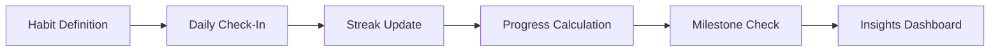

# Habit Tracker

Habit Tracker helps developers build consistent habits around code reviews, documentation updates, security checks, and learning goals. It tracks daily streaks, completion rates, and provides visual progress feedback.

## Features

- Habit Library: Pre-defined engineering habits like daily commits, PR reviews, and security scans
- Streak Tracking: Visual streak counters with milestone badges and achievement rewards
- Custom Goals: Create personalized habits with frequency, time, and measurement targets
- Progress Dashboard: Charts showing completion rates, trends, and consistency scores
- Reminder System: Configurable notifications for due or missed habit completions

## Workflow

## Usage

View the full documentation on GitHub: [Tool Directory](https://github.com/kleinnner/Anticloud/tree/main/12-api-oss-tools/habit-tracker)

## Related Tools

- [Focus Timer](../utilities/focus-timer)
- [Readiness Quiz](../utilities/readiness-quiz)
- [Local Notes](../utilities/local-notes)
