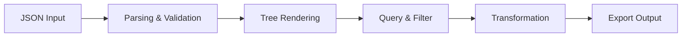

# JSON Explorer

JSON Explorer provides an interactive interface for working with JSON data structures. It offers tree-based navigation, JSONPath querying, schema validation, and conversion between JSON, YAML, and XML formats.

## Features

- Tree Navigation: Expandable and collapsible tree view with type-icon indicators and value previews
- JSONPath Queries: Search and filter JSON data using standard JSONPath expressions
- Schema Validation: Validate JSON documents against JSON Schema drafts 04, 06, 07, and 2019-09
- Format Conversion: Convert between JSON, YAML, TOML, and XML with formatting options
- Transformation Tools: Merge, diff, sort, filter, and transform JSON nodes interactively

## Workflow

## Usage

View the full documentation on GitHub: [Tool Directory](https://github.com/kleinnner/Anticloud/tree/main/12-api-oss-tools/json-explorer)

## Related Tools

- [SQL Formatter](../utilities/sql-formatter)
- [Diff Viewer](../utilities/diff-viewer)
- [Regex Playground](../utilities/regex-playground)
