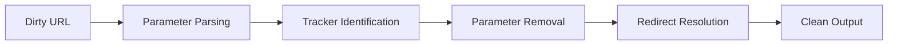

# Link Cleaner

Link Cleaner sanitizes URLs by removing tracking parameters, campaign tags, and analytics garbage. It produces clean, readable links suitable for documentation, code comments, and communication.

## Features

- Tracker Removal: Strip UTM parameters, Facebook clid, Google click IDs, and affiliate codes
- Redirect Bypass: Extract final destination URLs from link shorteners and redirect chains
- Batch Processing: Clean multiple URLs at once from pasted text or imported lists
- Markdown Output: Generate formatted markdown links with optional custom link text
- Custom Rules: Define your own parameter blocklists and URL transformation rules

## Workflow

## Usage

View the full documentation on GitHub: [Tool Directory](https://github.com/kleinnner/Anticloud/tree/main/12-api-oss-tools/link-cleaner)

## Related Tools

- [Local Notes](../utilities/local-notes)
- [Diff Viewer](../utilities/diff-viewer)
- [Privacy Scanner](../utilities/privacy-scanner)
