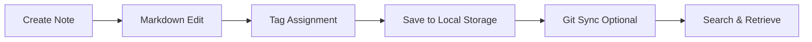

# Local Notes

Local Notes is a lightweight, offline-first note-taking application designed for developers. All notes are stored locally as markdown files with support for tagging, full-text search, and optional synchronization via Git.

## Features

- Markdown Editing: Rich markdown editor with live preview, syntax highlighting, and code blocks
- Tag System: Organize notes with hierarchical tags and cross-referencing
- Full-Text Search: Instant search across all notes with relevance ranking and snippet previews
- Git Integration: Optional version control with commit, diff, and push capabilities
- Export Options: Export individual notes or collections as PDF, HTML, or plain text

## Workflow

## Usage

View the full documentation on GitHub: [Tool Directory](https://github.com/kleinnner/Anticloud/tree/main/12-api-oss-tools/local-notes)

## Related Tools

- [Focus Timer](../utilities/focus-timer)
- [Habit Tracker](../utilities/habit-tracker)
- [Link Cleaner](../utilities/link-cleaner)
