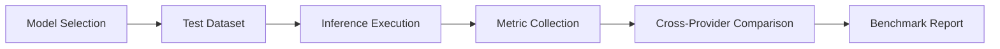

# Model Benchmark

Model Benchmark runs standardized performance tests against AI and machine learning models from major providers. It measures inference latency, throughput, cost per request, and accuracy on curated test datasets.

## Features

- Multi-Provider Testing: Benchmark models from OpenAI, Anthropic, Google, Meta, and open-source
- Performance Metrics: Measure time-to-first-token, tokens-per-second, and total response latency
- Cost Analysis: Calculate per-request and per-token costs across model tiers and providers
- Accuracy Evaluation: Run models against labeled test datasets for quality comparison
- Historical Trends: Track performance changes over time with version-aware benchmarking

## Workflow

## Usage

View the full documentation on GitHub: [Tool Directory](https://github.com/kleinnner/Anticloud/tree/main/12-api-oss-tools/model-benchmark)

## Related Tools

- [Privacy Scanner](../utilities/privacy-scanner)
- [Data Local Score](../utilities/data-local-score)
- [Readiness Quiz](../utilities/readiness-quiz)
