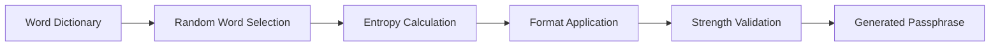

# Passphrase Generator

Passphrase Generator creates strong yet memorable passphrases by combining words from curated dictionaries. It provides real-time entropy estimation and supports custom word lists for multi-language and domain-specific passphrases.

## Features

- Word List Selection: Choose from EFF large/small word lists, Diceware, or custom dictionaries
- Entropy Display: Real-time entropy bits calculation with strength visualization and NIST guidance
- Format Options: Configure separator characters, capitalization, digit insertion, and padding
- Batch Generation: Generate multiple passphrases with one-click copy for comparison
- Strength Testing: Check generated passphrases against common pattern and dictionary attack heuristics

## Workflow

## Usage

View the full documentation on GitHub: [Tool Directory](https://github.com/kleinnner/Anticloud/tree/main/12-api-oss-tools/passphrase-generator)

## Related Tools

- [Secure Random](../security/secure-random)
- [TOTP Generator](../security/totp-generator)
- [Credential Vault](../security/credential-vault)
