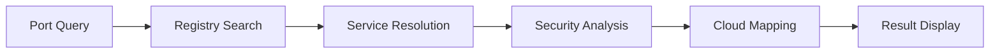

# Port Protocol Mapper

Port Protocol Mapper provides a searchable reference for TCP and UDP port assignments. It maps ports to their registered services, common cloud applications, and security implications with filtering by protocol and service category.

## Features

- Port Lookup: Search by port number, service name, or protocol with instant results
- IANA Registry: Up-to-date port assignments synchronized with the official IANA registry
- Cloud Service Mapping: Identify ports used by AWS, Azure, GCP, and Kubernetes services
- Security Context: Flag commonly abused ports and suggest firewall rule best practices
- Custom Annotations: Add organization-specific port notes, tags, and usage policies

## Workflow

## Usage

View the full documentation on GitHub: [Tool Directory](https://github.com/kleinnner/Anticloud/tree/main/12-api-oss-tools/port-protocol-mapper)

## Related Tools

- [Attack Surface Analyzer](../security/attack-surface)
- [Integration Checker](../analysis/integration-checker)
- [Privacy Scanner](../utilities/privacy-scanner)
