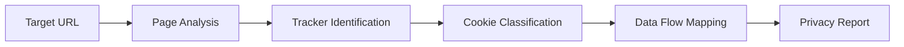

# Privacy Scanner

Privacy Scanner audits applications and websites for privacy compliance by detecting trackers, analyzing cookie policies, and identifying data collection practices. It produces a privacy risk score with detailed evidence for each finding.

## Features

- Tracker Detection: Identify analytics, advertising, and fingerprinting scripts on web pages
- Cookie Analysis: Classify cookies by purpose, domain, and expiration with consent requirement flags
- Data Collection Audit: Detect forms, beacons, and APIs that collect personal information
- Third-Party Sharing: Map data flows to external services and categorize their data usage
- Privacy Score: Generate an overall privacy rating with per-category breakdown and recommendations

## Workflow

## Usage

View the full documentation on GitHub: [Tool Directory](https://github.com/kleinnner/Anticloud/tree/main/12-api-oss-tools/privacy-scanner)

## Related Tools

- [Data Residency Map](../compliance/data-residency-map)
- [Data Local Score](../utilities/data-local-score)
- [Threat Model](../security/threat-model)
