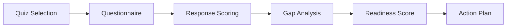

# Readiness Quiz

Readiness Quiz evaluates organizational preparedness for cloud initiatives through structured self-assessments. It covers security maturity, compliance posture, team skills, and infrastructure readiness with actionable improvement paths.

## Features

- Assessment Libraries: Pre-built quizzes for cloud migration, zero-trust, SOC 2, and FedRAMP readiness
- Skill Gap Analysis: Evaluate team capabilities across cloud platforms, security, and DevOps
- Infrastructure Scoring: Rate current infrastructure against target state requirements
- Progress Tracking: Re-take quizzes over time to measure improvement and readiness trends
- Action Plans: Generate prioritized remediation steps based on quiz results and score gaps

## Workflow

## Usage

View the full documentation on GitHub: [Tool Directory](https://github.com/kleinnner/Anticloud/tree/main/12-api-oss-tools/readiness-quiz)

## Related Tools

- [Habit Tracker](../utilities/habit-tracker)
- [Focus Timer](../utilities/focus-timer)
- [Compliance Checklist](../compliance/compliance-checklist)
