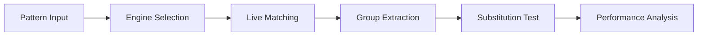

# Regex Playground

Regex Playground provides an interactive environment for building, testing, and debugging regular expressions. It shows real-time match highlights, capture group extraction, substitution previews, and cross-engine compatibility notes.

## Features

- Live Matching: Real-time highlighting of matches with capture group coloring and tooltips
- Substitution Preview: Test replacement patterns with immediate result display and diff highlighting
- Engine Selection: Switch between PCRE, ECMAScript, Python, Go, and Rust regex flavors
- Reference Guide: Built-in cheat sheet with common patterns, anchors, and quantifier examples
- Performance Profiling: Measure pattern compilation and matching time to detect catastrophic backtracking

## Workflow

## Usage

View the full documentation on GitHub: [Tool Directory](https://github.com/kleinnner/Anticloud/tree/main/12-api-oss-tools/regex-playground)

## Related Tools

- [SQL Formatter](../utilities/sql-formatter)
- [JSON Explorer](../utilities/json-explorer)
- [Diff Viewer](../utilities/diff-viewer)
