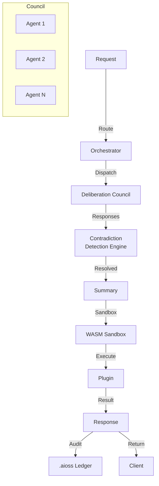
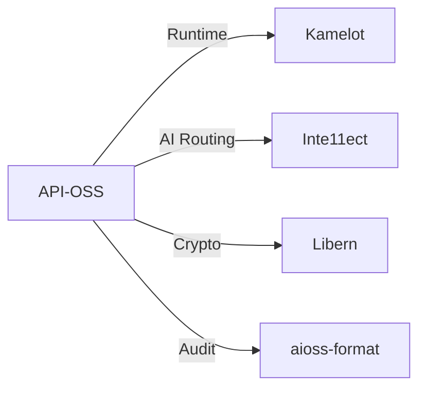
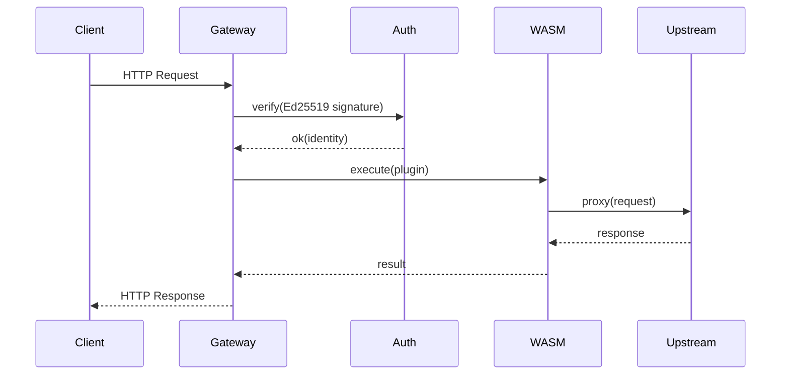

<!-- SEO -->
<meta name="description" content="API-OSS — sovereign API gateway with multi-agent deliberation councils, contradiction detection, 162 feature docs, WASM sandbox, and 30 research papers.">
<meta name="keywords" content="api-oss, API gateway, sovereign engine, rust, graphql, wasm">


<!-- Breadcrumb: Home > Projects > API-OSS -->


# API-OSS

Sovereign Open-Source API Gateway with multi-agent deliberation councils, contradiction detection engine, WASM sandbox, and comprehensive audit trail.

## Quick Facts

| Attribute | Value |
|-----------|-------|
| **Status** |  |
| **Category** | Cloud & AI |
| **Language** | Rust |
| **Source** | [`06-api-oss/`](https://github.com/kleinnner/Anticloud/tree/main/06-api-oss) |
| **Dependencies** | Kamelot, Libern |

## AI Gateway Pipeline



## Relationship Graph



## API Request Flow



## Key Features

- **Deliberation Councils**: Multi-agent consensus for AI decisions
- **Contradiction Detection**: Resolves conflicts between agent outputs
- **WASM Sandbox**: Secure plugin execution
- **162 Feature Docs**: Comprehensive API documentation
- **30 Research Papers**: Published research backing the architecture
- **Audit Trail**: All operations cryptographically signed

## Related Projects

| Project | Relationship | Protocol |
|---------|-------------|----------|
| [Kamelot](Kamelot) | Runtime — cloud function execution | gRPC |
| [Libern](Libern) | Cryptographic dependency — provides Ed25519, SHA3-256 | FFI |
| [Inte11ect](Inte11ect) | AI routing — intelligent request distribution | REST |

---

> 📖 **Full docs**: [Docusaurus API-OSS](https://kleinnner.github.io/Anticloud/docs/projects/api-oss) · [Home](Home) · [Projects](Projects) · [Architecture](Architecture) · [Ecosystem](Ecosystem) · [Roadmap](Roadmap) · [Glossary](Glossary) · [Protocol-Spec](Protocol-Spec)

```
.====================================================================.
!  Made in the UAE, Dubai #DubaiIt #Dubai #Dxb #SovereignAI          !
!  Made in The Emirates #Dubai_it                                    !
!                                                                    !
!  Lois-Kleinner Alpasan - The Anticloud 2026-                       !
!                                                                    !
!  0-1.gg ! GitHub ! LinkedIn ! DEV ! GH Pages                       !
!  HuggingFace ! Blog ! Tumblr ! Fandom ! Bluesky ! Mastodon          !
!  Zenodo ! Harvard Dataverse ! Internet Archive ! ORCID ! Figshare   !
!                                                                    !
!  Sovereign AI ! Local-First ! Privacy ! Zero Trust ! No Datacenter !
!  Air-Gapped ! Open Source ! Rust ! Hash Chain ! Single Binary      !
!  Offline LLM ! Crypto Ledger ! P2P ! Federated                     !
'===================================================================='
```

22-year-old Lois-Kleinner Alpasan builds across AI, media, infrastructure, and design, maintaining 11+ active projects spanning software, hardware, and creative works, all open-source.

References:
1. Lois-Kleinner Zenodo: https://doi.org/10.5281/zenodo.20781790
2. Lois-Kleinner GitHub: https://github.com/kleinnner/Anticloud/tree/main/04-aioss-format
3. Lois-Kleinner Harvard DV: https://doi.org/10.7910/DVN/GDLO0L
4. Lois-Kleinner Internet Arc: https://archive.org/details/aioss-format
5. Lois-Kleinner ORCID: https://orcid.org/0009-0009-2233-6107
6. Lois-Kleinner DEV.to: https://dev.to/kleinner
7. Lois-Kleinner LinkedIn: https://linkedin.com/in/kleinner
8. Lois-Kleinner HuggingFace: https://huggingface.co/Anticloud
9. Lois-Kleinner Tumblr: https://anticloud.tumblr.com
10. Lois-Kleinner Mastodon: https://mastodon.social/@kleinner
11. Lois-Kleinner Bluesky: https://bsky.app/profile/kleinner.bsky.social
12. 0-1.gg: https://0-1.gg
13. Lois-Kleinner Figshare: https://figshare.com/authors/Lois-Kleinner_Alpasan/20849885
