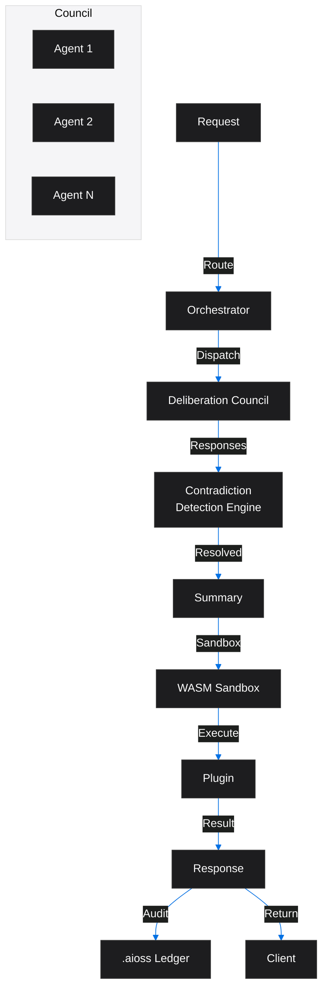
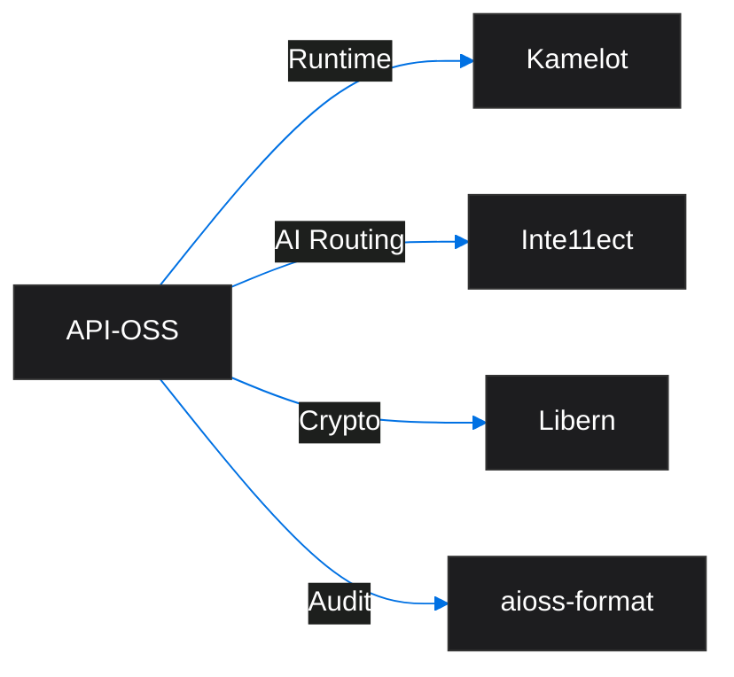
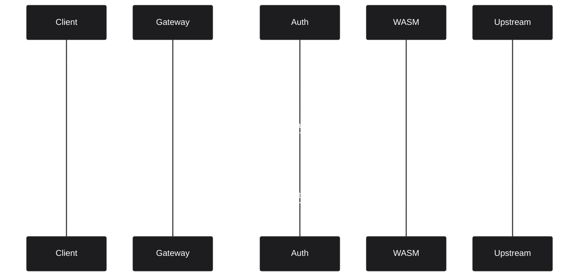

<!-- SEO -->
<meta name="description" content="API-OSS — sovereign API gateway with multi-agent deliberation councils, contradiction detection, 162 feature docs, WASM sandbox, and 30 research papers.">
<meta name="keywords" content="api-oss, API gateway, sovereign engine, rust, graphql, wasm">

<meta property="og:title" content="API-OSS — Anticloud Wiki">
<meta property="og:description" content="API-OSS — sovereign API gateway with multi-agent deliberation councils, contradiction detection, 162 feature docs, WASM sandbox, and 30 research papers.">
<meta property="og:image" content="https://kleinnner.github.io/Anticloud/img/og-image.png">
<meta property="og:type" content="website">
<meta name="twitter:card" content="summary_large_image">
<meta name="twitter:title" content="API-OSS">
<meta name="twitter:description" content="API-OSS — sovereign API gateway with multi-agent deliberation councils, contradiction detection, 162 feature docs, WASM sandbox, and 30 research papers.">
<link rel="canonical" href="https://github.com/kleinnner/Anticloud/wiki/API-OSS">

<!-- Breadcrumb: Home > Projects > API-OSS -->

# API-OSS

Sovereign Open-Source API Gateway with multi-agent deliberation councils, contradiction detection engine, WASM sandbox, and comprehensive audit trail.

## Quick Facts

| Attribute | Value |
|-----------|-------|
| **Status** |  |
| **Category** | Cloud & AI |
| **Language** | Rust |
| **Source** | [`06-api-oss/`](https://github.com/kleinnner/Anticloud/tree/main/06-api-oss) |
| **Dependencies** | Kamelot, Libern |

## AI Gateway Pipeline

## Relationship Graph

## API Request Flow

## Key Features

- **Deliberation Councils**: Multi-agent consensus for AI decisions
- **Contradiction Detection**: Resolves conflicts between agent outputs
- **WASM Sandbox**: Secure plugin execution
- **162 Feature Docs**: Comprehensive API documentation
- **30 Research Papers**: Published research backing the architecture
- **Audit Trail**: All operations cryptographically signed

## Related Projects

| Project | Relationship | Protocol |
|---------|-------------|----------|
| [Kamelot](Kamelot) | Runtime — cloud function execution | gRPC |
| [Libern](Libern) | Cryptographic dependency — provides Ed25519, SHA3-256 | FFI |
| [Inte11ect](Inte11ect) | AI routing — intelligent request distribution | REST |

---

> 📖 **Full docs**: [Docusaurus API-OSS](https://kleinnner.github.io/Anticloud/docs/projects/api-oss) · [Home](Home) · [Projects](Projects) · [Architecture](Architecture) · [Ecosystem](Ecosystem) · [Roadmap](Roadmap) · [Glossary](Glossary) · [Protocol-Spec](Protocol-Spec)
