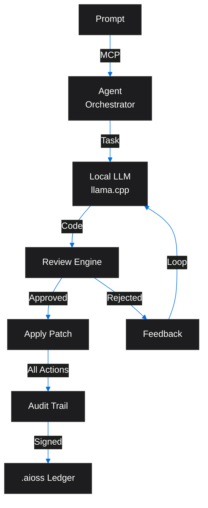
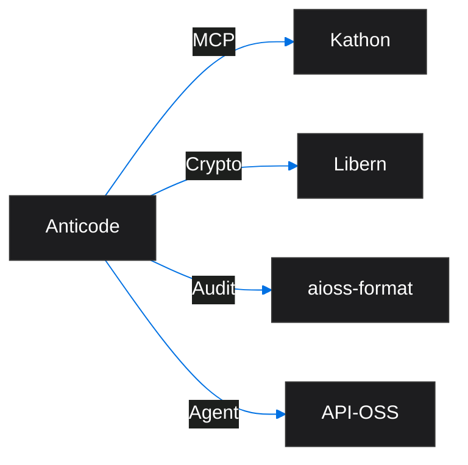
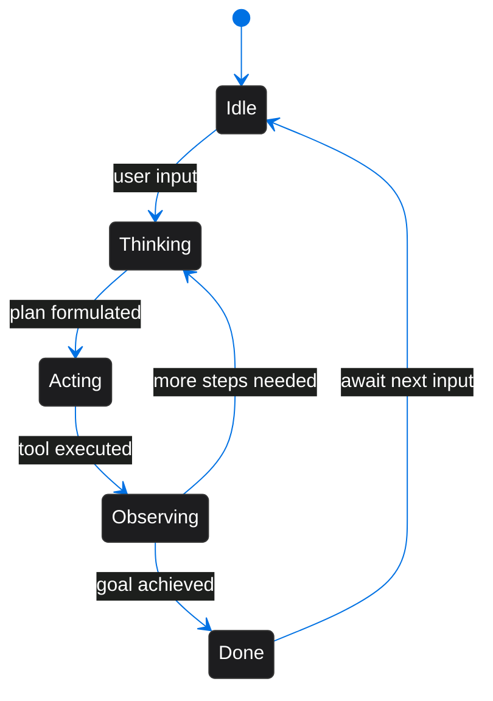

<!-- SEO -->
<meta name="description" content="Anticode — terminal-native AI coding engine running fully local LLMs with MCP protocol agent system, cryptographic audit trail for all AI actions, autonomous code generation.">
<meta name="keywords" content="anticode, AI IDE, code generation, developer tools, AI-assisted development">

<meta property="og:title" content="Anticode — Anticloud Wiki">
<meta property="og:description" content="Anticode — terminal-native AI coding engine running fully local LLMs with MCP protocol agent system, cryptographic audit trail for all AI actions, autonomous code generation.">
<meta property="og:image" content="https://kleinnner.github.io/Anticloud/img/og-image.png">
<meta property="og:type" content="website">
<meta name="twitter:card" content="summary_large_image">
<meta name="twitter:title" content="Anticode">
<meta name="twitter:description" content="Anticode — terminal-native AI coding engine running fully local LLMs with MCP protocol agent system, cryptographic audit trail for all AI actions, autonomous code generation.">
<link rel="canonical" href="https://github.com/kleinnner/Anticloud/wiki/Anticode">

<!-- Breadcrumb: Home > Projects > Anticode -->

# Anticode

Terminal-Native AI Coding Engine running fully local LLMs, MCP protocol agent system, cryptographic audit trail for all AI actions, and autonomous code generation.

## Quick Facts

| Attribute | Value |
|-----------|-------|
| **Status** |  |
| **Category** | Browser & Client |
| **Language** | TypeScript |
| **Source** | [`10-anticode/`](https://github.com/kleinnner/Anticloud/tree/main/10-anticode) |
| **Dependencies** | Kathon (MCP), Libern |

## Agent System Flow

## Relationship Graph

## AI Agent Lifecycle

## Key Features

- **Fully Local LLM**: Runs llama.cpp models without cloud dependency
- **MCP Protocol**: Model Context Protocol for agent orchestration
- **Review Engine**: Autonomous code review and improvement loop
- **Patch Application**: Direct file modification with rollback
- **Audit Trail**: Every AI action cryptographically signed
- **Terminal Native**: CLI-first experience for developers

## Related Projects

| Project | Relationship | Protocol |
|---------|-------------|----------|
| [Kathon](Kathon) | MCP protocol — model context provider | MCP |
| [Libern](Libern) | Cryptographic dependency — provides Ed25519, SHA3-256 | FFI |
| [API-OSS](API-OSS) | API gateway — REST interface for service orchestration | REST |

---

> 📖 **Full docs**: [Docusaurus Anticode](https://kleinnner.github.io/Anticloud/docs/projects/anticode) · [Home](Home) · [Projects](Projects) · [Architecture](Architecture) · [Ecosystem](Ecosystem) · [Roadmap](Roadmap) · [Glossary](Glossary) · [Protocol-Spec](Protocol-Spec)
