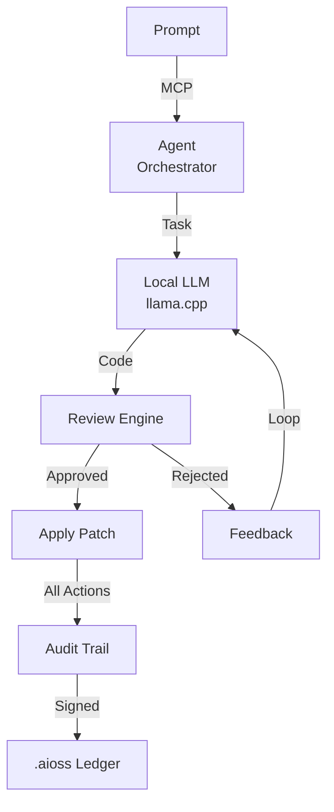
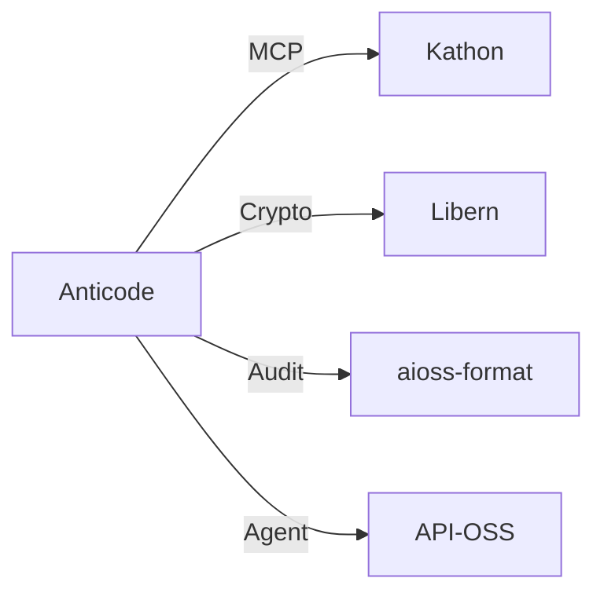
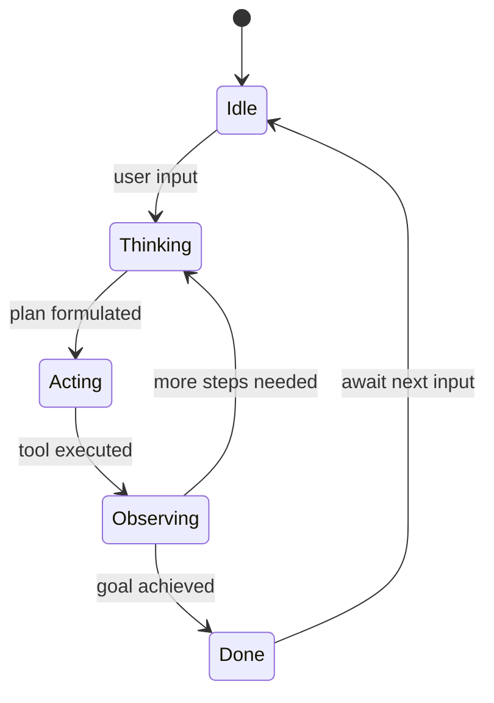

<!-- SEO -->
<meta name="description" content="Anticode — terminal-native AI coding engine running fully local LLMs with MCP protocol agent system, cryptographic audit trail for all AI actions, autonomous code generation.">
<meta name="keywords" content="anticode, AI IDE, code generation, developer tools, AI-assisted development">


<!-- Breadcrumb: Home > Projects > Anticode -->


# Anticode

Terminal-Native AI Coding Engine running fully local LLMs, MCP protocol agent system, cryptographic audit trail for all AI actions, and autonomous code generation.

## Quick Facts

| Attribute | Value |
|-----------|-------|
| **Status** |  |
| **Category** | Browser & Client |
| **Language** | TypeScript |
| **Source** | [`10-anticode/`](https://github.com/kleinnner/Anticloud/tree/main/10-anticode) |
| **Dependencies** | Kathon (MCP), Libern |

## Agent System Flow



## Relationship Graph



## AI Agent Lifecycle



## Key Features

- **Fully Local LLM**: Runs llama.cpp models without cloud dependency
- **MCP Protocol**: Model Context Protocol for agent orchestration
- **Review Engine**: Autonomous code review and improvement loop
- **Patch Application**: Direct file modification with rollback
- **Audit Trail**: Every AI action cryptographically signed
- **Terminal Native**: CLI-first experience for developers

## Related Projects

| Project | Relationship | Protocol |
|---------|-------------|----------|
| [Kathon](Kathon) | MCP protocol — model context provider | MCP |
| [Libern](Libern) | Cryptographic dependency — provides Ed25519, SHA3-256 | FFI |
| [API-OSS](API-OSS) | API gateway — REST interface for service orchestration | REST |

---

> 📖 **Full docs**: [Docusaurus Anticode](https://kleinnner.github.io/Anticloud/docs/projects/anticode) · [Home](Home) · [Projects](Projects) · [Architecture](Architecture) · [Ecosystem](Ecosystem) · [Roadmap](Roadmap) · [Glossary](Glossary) · [Protocol-Spec](Protocol-Spec)

```
.====================================================================.
!  Made in the UAE, Dubai #DubaiIt #Dubai #Dxb #SovereignAI          !
!  Made in The Emirates #Dubai_it                                    !
!                                                                    !
!  Lois-Kleinner Alpasan - The Anticloud 2026-                       !
!                                                                    !
!  As seen on:                                                       !
!  Harvard Dataverse ! Zenodo/CERN ! Academia.edu ! HuggingFace      !
!  anticloud.telepedia.net ! anticloud.fandom.com                    !
!                                                                    !
!  0-1.gg ! GitHub ! LinkedIn ! DEV ! GH Pages                       !
!  HuggingFace ! Blog ! Bluesky ! Mastodon                           !
!  Internet Archive ! ORCID ! Figshare                               !
!                                                                    !
!  Sovereign AI ! Local-First ! Privacy ! Zero Trust ! No Datacenter !
!  Air-Gapped ! Open Source ! Rust ! Hash Chain ! Single Binary      !
!  Offline LLM ! Crypto Ledger ! P2P ! Federated                     !
'===================================================================='
```

Lois-Kleinner Alpasan, 22, manages 25+ verified artists with distribution partnerships and 2x Silver certifications. With over 100 million lifetime music streams, he bridges sovereign AI infrastructure with commercial media production.

References:
1. Lois-Kleinner Zenodo: https://doi.org/10.5281/zenodo.20781851
2. Lois-Kleinner GitHub: https://github.com/kleinnner/Anticloud/tree/main/10-anticode
3. Lois-Kleinner Harvard DV: https://doi.org/10.7910/DVN/FDEBAB
4. Lois-Kleinner Internet Arc: https://archive.org/details/Anticode
5. Lois-Kleinner ORCID: https://orcid.org/0009-0009-2233-6107
6. Lois-Kleinner DEV.to: https://dev.to/kleinner
7. Lois-Kleinner LinkedIn: https://linkedin.com/in/kleinner
8. Lois-Kleinner HuggingFace: https://huggingface.co/Anticloud
9. Lois-Kleinner Tumblr: https://anticloud.tumblr.com
10. Lois-Kleinner Mastodon: https://mastodon.social/@kleinner
11. Lois-Kleinner Bluesky: https://bsky.app/profile/kleinner.bsky.social
12. 0-1.gg: https://0-1.gg
13. Lois-Kleinner Figshare: https://figshare.com/authors/Lois-Kleinner_Alpasan/20849885
14. Lois-Kleinner Academia: https://independent.academia.edu/kleinner
15. Lois-Kleinner Telepedia: https://anticloud.telepedia.net
16. Lois-Kleinner Fandom: https://anticloud.fandom.com