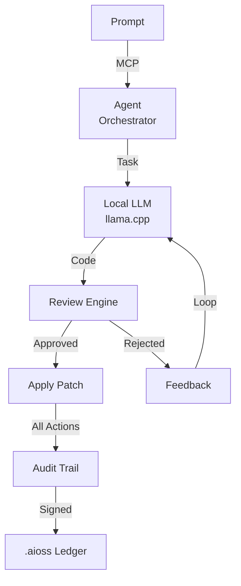
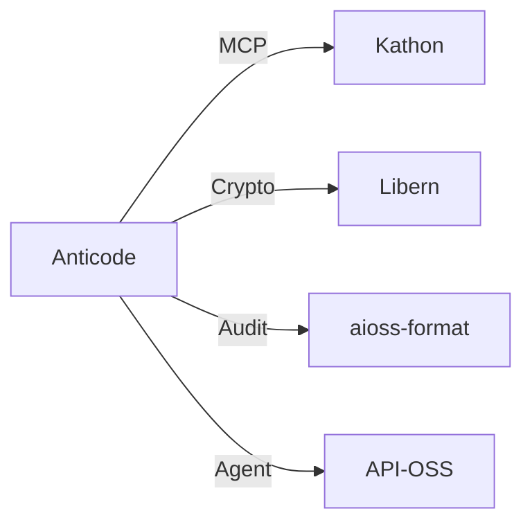

<!-- SEO -->
<meta name="description" content="Anticode — terminal-native AI coding engine running fully local LLMs with MCP protocol agent system, cryptographic audit trail for all AI actions, autonomous code generation.">
<meta name="keywords" content="anticode, AI IDE, code generation, developer tools, AI-assisted development">

# Anticode

Terminal-Native AI Coding Engine running fully local LLMs, MCP protocol agent system, cryptographic audit trail for all AI actions, and autonomous code generation.

## Quick Facts

| Attribute | Value |
|-----------|-------|
| **Status** |  |
| **Category** | Browser & Client |
| **Language** | TypeScript |
| **Source** | [`10-anticode/`](https://github.com/kleinnner/Anticloud/tree/main/10-anticode) |
| **Dependencies** | Kathon (MCP), Libern |

## Agent System Flow

## Relationship Graph

## Key Features

- **Fully Local LLM**: Runs llama.cpp models without cloud dependency
- **MCP Protocol**: Model Context Protocol for agent orchestration
- **Review Engine**: Autonomous code review and improvement loop
- **Patch Application**: Direct file modification with rollback
- **Audit Trail**: Every AI action cryptographically signed
- **Terminal Native**: CLI-first experience for developers

---

> 📖 **Full docs**: [Docusaurus Anticode](https://kleinnner.github.io/Anticloud/docs/projects/anticode) · [Home](Home) · [Projects](Projects) · [Architecture](Architecture)
