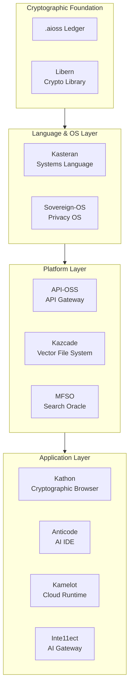
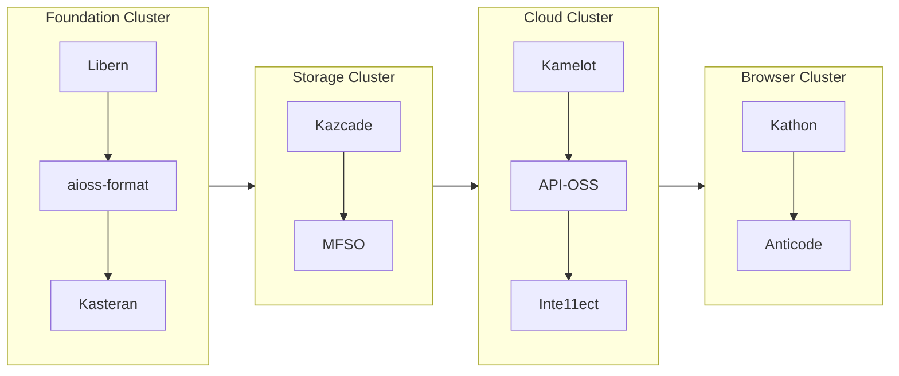
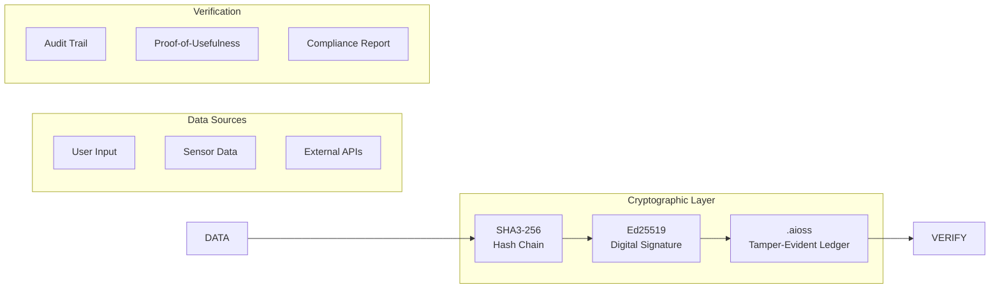

<!-- SEO -->
<meta name="description" content="Anticloud system architecture — 4-layer stack with cryptographic foundation, project clusters, and data flow diagrams.">
<meta name="keywords" content="anticloud, architecture, system design, cryptographic foundation, layers">

# System Architecture

The Anticloud ecosystem is organized into four architectural layers connected by a shared cryptographic foundation.

## Layer Architecture

## Project Clusters

Projects grouped by domain, sharing architectural patterns and protocols:

## Cryptographic Data Flow

All projects communicate through a unified cryptographic layer:

## Protocol Matrix

| Source | Target | Protocol | Purpose |
|--------|--------|----------|---------|
| Kathon | Kazcade | CRDT sync over P2P | Distributed state |
| Kamelot | API-OSS | REST + WebSocket | Service orchestration |
| API-OSS | Inte11ect | gRPC streaming | AI model routing |
| Kasteran | Libern | Native FFI bindings | Crypto primitives |
| Sovereign-OS | .aioss | Kernel-level ledger | Boot attestation |
| Anticode | Kathon | LSP + MCP | AI-assisted coding |
| Libern | aioss-format | SHA3-256 chain | Audit trail |

---

> 📖 **Full docs**: [Docusaurus Architecture](https://kleinnner.github.io/Anticloud/docs/intro) · [Home](Home) · [Projects](Projects) · [Tools](Tools) · [Ecosystem](Ecosystem)
