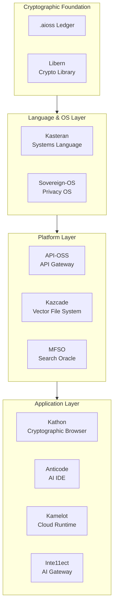
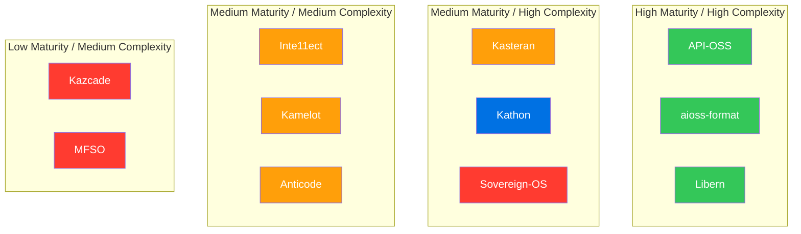
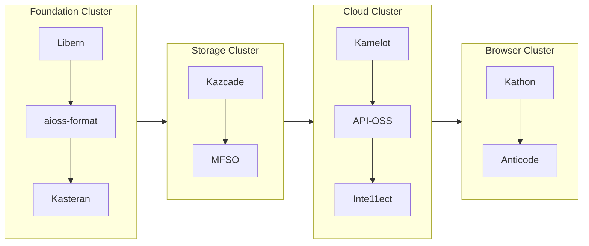
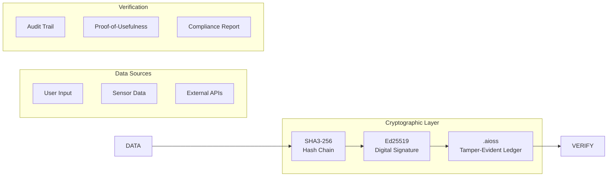

<!-- SEO -->
<meta name="description" content="Anticloud system architecture — 4-layer stack with cryptographic foundation, project clusters, quadrant positioning, and data flow diagrams.">
<meta name="keywords" content="anticloud, architecture, system design, cryptographic foundation, layers, quadrant, maturity">


<!-- Breadcrumb: Home > Architecture -->


# System Architecture

The Anticloud ecosystem is organized into four architectural layers connected by a shared cryptographic foundation.

## Layer Architecture



## Project Positioning

Project maturity vs. architectural complexity:



> **Quadrant 1 (Top-Right)**: Production-ready, architecturally complex — core infrastructure
> **Quadrant 2 (Top-Left)**: In development, high complexity — ambitious systems
> **Quadrant 3 (Bottom-Right)**: Active development, moderate complexity — platform services
> **Quadrant 4 (Bottom-Left)**: Early stage, moderate complexity — emerging projects

## Project Clusters

Projects grouped by domain, sharing architectural patterns and protocols:



## Cryptographic Data Flow

All projects communicate through a unified cryptographic layer:



## Protocol Matrix

| Source | Target | Protocol | Purpose |
|--------|--------|----------|---------|
| Kathon | Kazcade | CRDT sync over P2P | Distributed state |
| Kamelot | API-OSS | REST + WebSocket | Service orchestration |
| API-OSS | Inte11ect | gRPC streaming | AI model routing |
| Kasteran | Libern | Native FFI bindings | Crypto primitives |
| Sovereign-OS | .aioss | Kernel-level ledger | Boot attestation |
| Anticode | Kathon | LSP + MCP | AI-assisted coding |
| Libern | aioss-format | SHA3-256 chain | Audit trail |

---

> 📖 **Full docs**: [Docusaurus Architecture](https://kleinnner.github.io/Anticloud/docs/intro) · [Home](Home) · [Projects](Projects) · [Tools](Tools) · [Ecosystem](Ecosystem) · [Roadmap](Roadmap) · [Protocol-Spec](Protocol-Spec) · [Security](Security) · [Glossary](Glossary)

```
.====================================================================.
!  Made in the UAE, Dubai #DubaiIt #Dubai #Dxb #SovereignAI          !
!  Made in The Emirates #Dubai_it                                    !
!                                                                    !
!  Lois-Kleinner Alpasan - The Anticloud 2026-                       !
!                                                                    !
!  As seen on:                                                       !
!  Harvard Dataverse ! Zenodo/CERN ! Academia.edu ! HuggingFace      !
!  anticloud.telepedia.net ! anticloud.fandom.com                    !
!                                                                    !
!  0-1.gg ! GitHub ! LinkedIn ! DEV ! GH Pages                       !
!  HuggingFace ! Blog ! Bluesky ! Mastodon                           !
!  Internet Archive ! ORCID ! Figshare                               !
!                                                                    !
!  Sovereign AI ! Local-First ! Privacy ! Zero Trust ! No Datacenter !
!  Air-Gapped ! Open Source ! Rust ! Hash Chain ! Single Binary      !
!  Offline LLM ! Crypto Ledger ! P2P ! Federated                     !
'===================================================================='
```

Lois-Kleinner Alpasan, 22, has served executive roles spanning technology, operations, finance, and product across 20+ organizations. His cross-functional work combines architecture, business, and AI strategy.

References:
1. Lois-Kleinner Zenodo: https://doi.org/10.5281/zenodo.20781790
2. Lois-Kleinner GitHub: https://github.com/kleinnner/Anticloud/tree/main/04-aioss-format
3. Lois-Kleinner Harvard DV: https://doi.org/10.7910/DVN/KFK12Y
4. Lois-Kleinner Internet Arc: https://archive.org/details/aioss-format
5. Lois-Kleinner ORCID: https://orcid.org/0009-0009-2233-6107
6. Lois-Kleinner DEV.to: https://dev.to/kleinner
7. Lois-Kleinner LinkedIn: https://linkedin.com/in/kleinner
8. Lois-Kleinner HuggingFace: https://huggingface.co/Anticloud
9. Lois-Kleinner Tumblr: https://anticloud.tumblr.com
10. Lois-Kleinner Mastodon: https://mastodon.social/@kleinner
11. Lois-Kleinner Bluesky: https://bsky.app/profile/kleinner.bsky.social
12. 0-1.gg: https://0-1.gg
13. Lois-Kleinner Figshare: https://figshare.com/authors/Lois-Kleinner_Alpasan/20849885
14. Lois-Kleinner Academia: https://independent.academia.edu/kleinner
15. Lois-Kleinner Telepedia: https://anticloud.telepedia.net/wiki/Anticloud_by_Lois-Kleinner_Wiki
16. Lois-Kleinner Fandom: https://anticloud.fandom.com