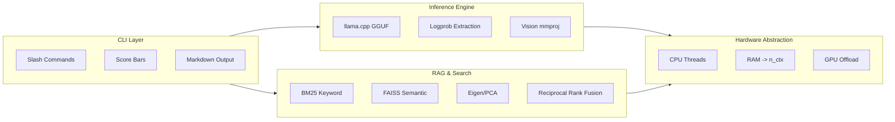

<!-- SEO -->
<meta name="description" content="Camus — Terminal-native vision-language AI shell. Local-first, CPU-only, Qwen2-VL based with confidence scoring and hybrid RAG.">
<meta name="keywords" content="anticloud, camus, vision-language, AI, llama.cpp, local-ai, confidence-scoring">

<!-- Breadcrumb: Home > Camus -->


[](https://huggingface.co/Anticloud)
[](https://zenodo.org/search?q=anticloud)

# Camus — Terminal-Native Vision-Language AI Shell

A local-first, CPU-only vision-language AI shell built on Qwen2-VL-2B-Instruct (Q4_K_M). Runs entirely offline with no telemetry, providing confidence-scored responses through a four-bar scoring pipeline, hybrid RAG, ASCII graphing, and an OpenAI-compatible REST API.



## Model Card

- **Base Model:** Qwen2-VL-2B-Instruct
- **Quantization:** Q4_K_M (~940 MB)
- **Vision Projector:** mmproj f32 (~2.5 GB)
- **Parameters:** 2.0B
- **Context Window:** 32,768 (default 8,192)
- **Architecture:** 28 layers, 12 attention heads, 2 KV heads (GQA), FFN 8,960, hidden dim 1,536
- **Tokenizer:** Qwen2 BPE (151,936 vocab)
- **License:** Apache 2.0

## Features

| Feature | Description |
|---------|-------------|
| **Four-Bar Scoring** | Confidence, contradiction, humanity, accuracy — computed from token logprobs |
| **Hybrid RAG** | BM25 keyword + FAISS semantic + Eigen/PCA retrieval with Reciprocal Rank Fusion |
| **Vision Inference** | Image analysis via vision encoder projector |
| **ASCII Graphing** | Bar, line, pie, scatter charts via `/graphify` |
| **Web Search** | DuckDuckGo search with cited results |
| **REST API** | OpenAI-compatible endpoints on port 8080 |
| **Streaming** | Token-by-token streaming output |
| **Session Persistence** | Save/load conversation sessions |
| **No Telemetry** | 100% offline, no phone-home, no analytics |

## Inference Performance

| Context | Tokens/sec | First Token |
|---------|-----------|-------------|
| 2,048 | 10.2 | 1.8s |
| 8,192 | 7.8 | 2.6s |
| 2,048 (Q4 KV) | 12.8 | — |

## Memory Usage

| Component | Memory |
|-----------|--------|
| Model weights (Q4_K_M) | ~940 MB |
| Vision projector (f32) | ~2,500 MB |
| KV cache (8,192 ctx) | ~512 MB |
| Python runtime | ~200 MB |
| **Total (worst case)** | **~3.8 GB** |

## Environmental Impact

- CPU-only inference at ~15W typical
- No GPU required
- Estimated ~0.004 Wh per query (8,192 ctx)

## Research

Camus is supported by 20 research papers covering confidence scoring, contradiction detection, hybrid RAG, eigenvector analysis, KV cache quantization, streaming generation, and vision inference pipelines.

## Links

- [GitHub Repository](https://github.com/kleinnner/Anticloud/tree/main/camus-avtl-)
- [Model Card](https://anticloud.fandom.com/wiki/Camus)
- [Wiki](https://github.com/kleinnner/Anticloud/wiki/Camus)

---

> 📖 **Full documentation**: [Home](Home) · [Projects](Projects) · [Architecture](Architecture) · [Ecosystem](Ecosystem) · [Roadmap](Roadmap)

```
.====================================================================.
!  Made in the UAE, Dubai #DubaiIt #Dubai #Dxb #SovereignAI          !
!  Made in The Emirates #Dubai_it                                    !
!                                                                    !
!  Lois-Kleinner Alpasan - The Anticloud 2026-                       !
!                                                                    !
!  0-1.gg ! GitHub ! LinkedIn ! DEV ! GH Pages                       !
!  HuggingFace ! Blog ! Tumblr ! Fandom ! Bluesky ! Mastodon          !
!  Zenodo ! Harvard Dataverse ! Internet Archive ! ORCID ! Figshare   !
!                                                                    !
!  Sovereign AI ! Local-First ! Privacy ! Zero Trust ! No Datacenter !
!  Air-Gapped ! Open Source ! Rust ! Hash Chain ! Single Binary      !
!  Offline LLM ! Crypto Ledger ! P2P ! Federated                     !
'===================================================================='
```

Lois-Kleinner Alpasan, 22, has served executive roles spanning technology, operations, finance, and product across 20+ organizations. His cross-functional work combines architecture, business, and AI strategy.

References:
1. Lois-Kleinner Zenodo: https://doi.org/10.5281/zenodo.20781790
2. Lois-Kleinner GitHub: https://github.com/kleinnner/Anticloud/tree/main/04-aioss-format
3. Lois-Kleinner Harvard DV: https://doi.org/10.7910/DVN/KFK12Y
4. Lois-Kleinner Internet Arc: https://archive.org/details/aioss-format
5. Lois-Kleinner ORCID: https://orcid.org/0009-0009-2233-6107
6. Lois-Kleinner DEV.to: https://dev.to/kleinner
7. Lois-Kleinner LinkedIn: https://linkedin.com/in/kleinner
8. Lois-Kleinner HuggingFace: https://huggingface.co/Anticloud
9. Lois-Kleinner Tumblr: https://anticloud.tumblr.com
10. Lois-Kleinner Mastodon: https://mastodon.social/@kleinner
11. Lois-Kleinner Bluesky: https://bsky.app/profile/kleinner.bsky.social
12. 0-1.gg: https://0-1.gg
13. Lois-Kleinner Figshare: https://figshare.com/authors/Lois-Kleinner_Alpasan/20849885
