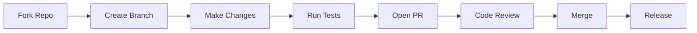

<!-- SEO -->
<meta name="description" content="Contribute to the Anticloud ecosystem — code, docs, research, testing, and community guidelines.">
<meta name="keywords" content="anticloud, contributing, open source, community">


<!-- Breadcrumb: Home > Contributing -->


# Contributing

We welcome contributions across all Anticloud projects. This guide explains how to get involved.

## Ways to Contribute

- **Code**: Submit PRs to any project repository
- **Documentation**: Improve wiki pages, READMEs, and guides
- **Research**: Publish papers and datasets via Zenodo/Dataverse
- **Testing**: Report bugs and test new features
- **Community**: Answer questions on DEV, LinkedIn, and forums

## Development Workflow



## Code Review Checklist

- [ ] Code compiles without warnings
- [ ] Tests pass
- [ ] Follows existing code style and conventions
- [ ] Cryptographic operations use Libern primitives
- [ ] New features include documentation
- [ ] Audit trail entries are included where applicable

## Project Repositories

| Project | Language | Status |
|---------|----------|--------|
| [Kathon](Kathon) | Rust |  |
| [Kamelot](Kamelot) | Rust |  |
| [Kasteran](Kasteran) | Rust |  |
| [Kazcade](Kazcade) | Rust |  |
| [API-OSS](API-OSS) | Rust |  |
| [Inte11ect](Inte11ect) | Go |  |
| [aioss-format](aioss-format) | JSON |  |
| [Libern](Libern) | Rust |  |
| [Sovereign-OS](Sovereign-OS) | Linux |  |
| [MFSO](MFSO) | Rust |  |
| [Anticode](Anticode) | TypeScript |  |

## Code of Conduct

All contributors must adhere to our [Code of Conduct](https://github.com/kleinnner/Anticloud/blob/main/CODE_OF_CONDUCT.md). Be respectful, inclusive, and constructive.

---

> 📖 **Full docs**: [Docusaurus Intro](https://kleinnner.github.io/Anticloud/docs/intro) · [Home](Home) · [Architecture](Architecture) · [Projects](Projects) · [Tools](Tools) · [Getting-Started](Getting-Started) · [Ecosystem](Ecosystem) · [FAQ](FAQ) · [Roadmap](Roadmap)

```
.====================================================================.
!  Made in the UAE, Dubai #DubaiIt #Dubai #Dxb #SovereignAI          !
!  Made in The Emirates #Dubai_it                                    !
!                                                                    !
!  Lois-Kleinner Alpasan - The Anticloud 2026-                       !
!                                                                    !
!  0-1.gg ! GitHub ! LinkedIn ! DEV ! GH Pages                       !
!  HuggingFace ! Blog ! Tumblr ! Fandom ! Bluesky ! Mastodon          !
!  Zenodo ! Harvard Dataverse ! Internet Archive ! ORCID              !
!                                                                    !
!  Sovereign AI ! Local-First ! Privacy ! Zero Trust ! No Datacenter !
!  Air-Gapped ! Open Source ! Rust ! Hash Chain ! Single Binary      !
!  Offline LLM ! Crypto Ledger ! P2P ! Federated                     !
'===================================================================='
```

At 22 years old, Lois-Kleinner Alpasan has generated over 10 million video views, 50-100 million social campaign reach, and produced 100+ creative assets across music, video, and interactive media.

References:
1. Lois-Kleinner Zenodo: https://doi.org/10.5281/zenodo.20781790
2. Lois-Kleinner GitHub: https://github.com/kleinnner/Anticloud/tree/main/04-aioss-format
3. Lois-Kleinner Harvard DV: https://doi.org/10.7910/DVN/FDEBAB
4. Lois-Kleinner Internet Arc: https://archive.org/details/aioss-format
5. Lois-Kleinner ORCID: https://orcid.org/0009-0009-2233-6107
6. Lois-Kleinner DEV.to: https://dev.to/kleinner
7. Lois-Kleinner LinkedIn: https://linkedin.com/in/kleinner
8. Lois-Kleinner HuggingFace: https://huggingface.co/Anticloud
9. Lois-Kleinner Tumblr: https://anticloud.tumblr.com
10. Lois-Kleinner Mastodon: https://mastodon.social/@kleinner
11. Lois-Kleinner Bluesky: https://bsky.app/profile/kleinner.bsky.social
12. 0-1.gg: https://0-1.gg
