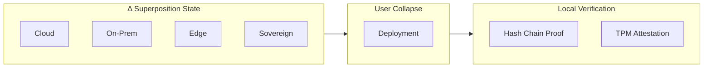

<!-- SEO -->
<meta name="description" content="ΔaaS — Delta as a Service. A philosophical manifesto redefining 'as a Service' to mean superposition of all possible computing states until deployment.">
<meta name="keywords" content="anticloud, daas, delta, superposition, post-cloud, manifesto, sovereign-computing">

<!-- Breadcrumb: Home > ΔaaS -->

# ΔaaS — Delta as a Service

ΔaaS (Delta as a Service) is a **philosophical framework** that redefines "as a Service" to mean deployable capability, not hosted dependency. Borrowing from quantum mechanics, the Δ operator places computing systems in superposition across all possible providers, architectures, and paradigms — never collapsing into any single dependency until the user chooses to deploy.

> **"ΔaaS requires one machine, one binary, and zero trust in anyone."**

## The Five Δ Principles

1. **Superposition** — A sovereign system exists in multiple possible states simultaneously
2. **Measurement** — The user determines when collapse occurs
3. **Deferred commitment** — No architectural decision is made before it is necessary
4. **Local verification** — Trust is established through locally verifiable cryptographic proofs
5. **Single binary, single machine** — The deployment model must match the sovereignty principle

## Core Thesis

> Δ|system⟩ = |sovereign⟩ + |cloud⟩ + |on-prem⟩ + |edge⟩ + ...

A computing system should **never collapse into a single provider's infrastructure** (AWS, Azure, GCP). Instead, it should remain in superposition across **all possible providers, architectures, and paradigms** until the moment of deployment.

## Research Papers

ΔaaS includes 20 research papers covering:
- The Δ operator in computing
- Post-cloud superposition
- Anti-SaaS paradox
- Kernel-level sovereignty
- State vector ledgers
- Hash chains as time crystals
- Cross-project applications (Kathon, API-OSS, Kamelot, MF+SO)
- Δ economics and compliance

## Ecosystem Integration

ΔaaS is the philosophical foundation of The Anticloud. Each project implements Δ principles:

| Project | Δ Implementation |
|---------|-----------------|
| **Kathon** | Tabs exist in superposition of all pages until visited |
| **API-OSS** | Every output is superposition of council deliberation |
| **MF+SO** | Identity is superposition of roles until authenticated |
| **Kamelot** | Files exist at superposition of semantic locations |
| **Inte11ect** | 74 expert modules in superposition until query collapses them |

## Links

- [GitHub Repository](https://github.com/kleinnner/Anticloud/tree/main/daas)
- [Full Manifesto](https://anticloud.fandom.com/wiki/Delta_as_a_Service)
- [Wiki](https://github.com/kleinnner/Anticloud/wiki/DeltaaaS)

---

> 📖 **Full documentation**: [Home](Home) · [Projects](Projects) · [Architecture](Architecture) · [Ecosystem](Ecosystem) · [Roadmap](Roadmap)
