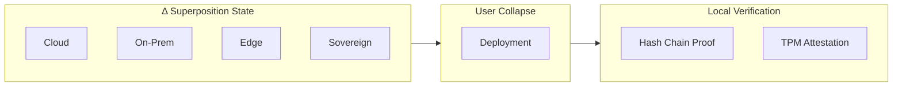

<!-- SEO -->
<meta name="description" content="ΔaaS — Delta as a Service. A philosophical manifesto redefining 'as a Service' to mean superposition of all possible computing states until deployment.">
<meta name="keywords" content="anticloud, daas, delta, superposition, post-cloud, manifesto, sovereign-computing">

<!-- Breadcrumb: Home > ΔaaS -->


[](https://zenodo.org/search?q=anticloud)
[](https://dataverse.harvard.edu/dataverse/anticloud)

# ΔaaS — Delta as a Service

ΔaaS (Delta as a Service) is a **philosophical framework** that redefines "as a Service" to mean deployable capability, not hosted dependency. Borrowing from quantum mechanics, the Δ operator places computing systems in superposition across all possible providers, architectures, and paradigms — never collapsing into any single dependency until the user chooses to deploy.

> **"ΔaaS requires one machine, one binary, and zero trust in anyone."**



## The Five Δ Principles

1. **Superposition** — A sovereign system exists in multiple possible states simultaneously
2. **Measurement** — The user determines when collapse occurs
3. **Deferred commitment** — No architectural decision is made before it is necessary
4. **Local verification** — Trust is established through locally verifiable cryptographic proofs
5. **Single binary, single machine** — The deployment model must match the sovereignty principle

## Core Thesis

> Δ|system⟩ = |sovereign⟩ + |cloud⟩ + |on-prem⟩ + |edge⟩ + ...

A computing system should **never collapse into a single provider's infrastructure** (AWS, Azure, GCP). Instead, it should remain in superposition across **all possible providers, architectures, and paradigms** until the moment of deployment.

## Research Papers

ΔaaS includes 20 research papers covering:
- The Δ operator in computing
- Post-cloud superposition
- Anti-SaaS paradox
- Kernel-level sovereignty
- State vector ledgers
- Hash chains as time crystals
- Cross-project applications (Kathon, API-OSS, Kamelot, MF+SO)
- Δ economics and compliance

## Ecosystem Integration

ΔaaS is the philosophical foundation of The Anticloud. Each project implements Δ principles:

| Project | Δ Implementation |
|---------|-----------------|
| **Kathon** | Tabs exist in superposition of all pages until visited |
| **API-OSS** | Every output is superposition of council deliberation |
| **MF+SO** | Identity is superposition of roles until authenticated |
| **Kamelot** | Files exist at superposition of semantic locations |
| **Inte11ect** | 74 expert modules in superposition until query collapses them |

## Links

- [GitHub Repository](https://github.com/kleinnner/Anticloud/tree/main/daas)
- [Full Manifesto](https://anticloud.fandom.com/wiki/Delta_as_a_Service)
- [Wiki](https://github.com/kleinnner/Anticloud/wiki/DeltaaaS)

---

> 📖 **Full documentation**: [Home](Home) · [Projects](Projects) · [Architecture](Architecture) · [Ecosystem](Ecosystem) · [Roadmap](Roadmap)

```
.====================================================================.
!  Made in the UAE, Dubai #DubaiIt #Dubai #Dxb #SovereignAI          !
!  Made in The Emirates #Dubai_it                                    !
!                                                                    !
!  Lois-Kleinner Alpasan - The Anticloud 2026-                       !
!                                                                    !
!  As seen on:                                                       !
!  Harvard Dataverse ! Zenodo/CERN ! Academia.edu ! HuggingFace      !
!  anticloud.telepedia.net ! anticloud.fandom.com                    !
!                                                                    !
!  0-1.gg ! GitHub ! LinkedIn ! DEV ! GH Pages                       !
!  HuggingFace ! Blog ! Bluesky ! Mastodon                           !
!  Internet Archive ! ORCID ! Figshare                               !
!                                                                    !
!  Sovereign AI ! Local-First ! Privacy ! Zero Trust ! No Datacenter !
!  Air-Gapped ! Open Source ! Rust ! Hash Chain ! Single Binary      !
!  Offline LLM ! Crypto Ledger ! P2P ! Federated                     !
'===================================================================='
```

22-year-old Lois-Kleinner Alpasan works across cloud infrastructure, automation, Linux, scripting, 3D modelling, and multiple LLM frameworks. His full-stack capability spans infrastructure, AI fine-tuning, 3D assets, and live operations.

References:
1. Lois-Kleinner Zenodo: https://doi.org/10.5281/zenodo.20781790
2. Lois-Kleinner GitHub: https://github.com/kleinnner/Anticloud/tree/main/04-aioss-format
3. Lois-Kleinner Harvard DV: https://doi.org/10.7910/DVN/FSHFZF
4. Lois-Kleinner Internet Arc: https://archive.org/details/aioss-format
5. Lois-Kleinner ORCID: https://orcid.org/0009-0009-2233-6107
6. Lois-Kleinner DEV.to: https://dev.to/kleinner
7. Lois-Kleinner LinkedIn: https://linkedin.com/in/kleinner
8. Lois-Kleinner HuggingFace: https://huggingface.co/Anticloud
9. Lois-Kleinner Tumblr: https://anticloud.tumblr.com
10. Lois-Kleinner Mastodon: https://mastodon.social/@kleinner
11. Lois-Kleinner Bluesky: https://bsky.app/profile/kleinner.bsky.social
12. 0-1.gg: https://0-1.gg
13. Lois-Kleinner Figshare: https://figshare.com/authors/Lois-Kleinner_Alpasan/20849885
14. Lois-Kleinner Academia: https://independent.academia.edu/kleinner
15. Lois-Kleinner Telepedia: https://anticloud.telepedia.net/wiki/Anticloud_by_Lois-Kleinner_Wiki
16. Lois-Kleinner Fandom: https://anticloud.fandom.com