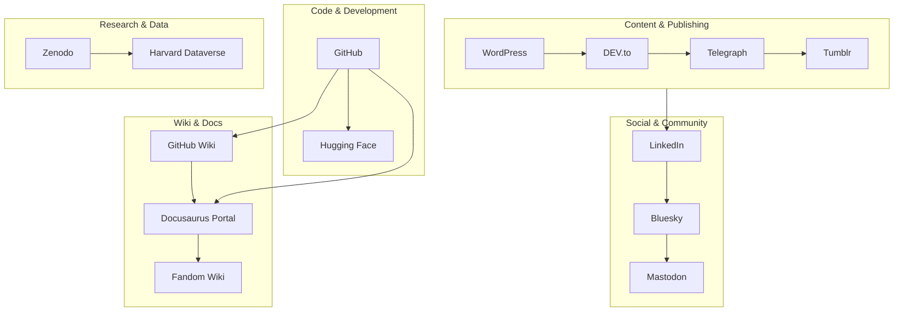

<!-- SEO -->
<meta name="description" content="Anticloud ecosystem — all platforms, profiles, research repositories, and community connections across the web.">
<meta name="keywords" content="anticloud ecosystem, github, linkedin, dev.to, hugging face, zenodo, dataverse">


<!-- Breadcrumb: Home > Ecosystem -->


# Ecosystem & Platforms

The Anticloud presence extends across multiple platforms for code, research, publishing, and community.

## Platform Map

```mermaid
flowchart LR
    CENTER((Anticloud))
    CENTER --> GIT[GitHub<br/>kleinnner/Anticloud]
    CENTER --> MAIN[Main Site<br/>0-1.gg]
    CENTER --> LINK[LinkedIn<br/>/in/kleinner]
    CENTER --> DEV[DEV.to<br/>@kleinner]
    CENTER --> HF[Hugging Face<br/>Anticloud]
    CENTER --> WP[WordPress<br/>anticlouds.wordpress.com]
    CENTER --> FM[Fandom Wiki<br/>anticloud.fandom.com]
    CENTER --> TU[Tumblr<br/>anticloud.tumblr.com]
    CENTER --> BS[Bluesky<br/>@kleinner]
    CENTER --> MA[Mastodon<br/>@kleinner]
    CENTER --> TG[Telegraph<br/>@kleinner]
    CENTER --> ZN[Zenodo<br/>anticloud]
    CENTER --> HD[Harvard Dataverse<br/>anticloud]
```

## Platform Categories



## Main Profiles

| Platform | Link | Purpose |
|----------|------|---------|
| GitHub | [kleinnner/Anticloud](https://github.com/kleinnner/Anticloud) | Source code & issues |
| Main Site | [0-1.gg](https://0-1.gg) | Personal portal |
| LinkedIn | [/in/kleinner](https://linkedin.com/in/kleinner) | Professional network |
| DEV.to | [@kleinner](https://dev.to/kleinner) | Technical articles |
| Hugging Face | [Anticloud](https://huggingface.co/Anticloud) | AI models & datasets |

## Wikis & Documentation

| Platform | Link | Description |
|----------|------|-------------|
| **GitHub Wiki** | [Anticloud Wiki](https://github.com/kleinnner/Anticloud/wiki) | Technical wiki |
| Fandom Wiki | [anticloud.fandom.com](https://anticloud.fandom.com) | Community knowledge base |
| Docusaurus Portal | [kleinnner.github.io/Anticloud](https://kleinnner.github.io/Anticloud/) | Main documentation site |

## Publishing & Social

| Platform | Link | Content |
|----------|------|---------|
| WordPress Blog | [anticlouds.wordpress.com](https://anticlouds.wordpress.com) | Blog posts & updates |
| Tumblr | [anticloud.tumblr.com](https://anticloud.tumblr.com) | Microblogging |
| Telegraph | [@kleinner](https://telegra.ph/kleinner) | Long-form articles |
| Bluesky | [@kleinner](https://bsky.app/profile/kleinner.bsky.social) | Social updates |
| Mastodon | [@kleinner](https://mastodon.social/@kleinner) | Decentralized social |

## Research Repositories

| Platform | Link | Holdings |
|----------|------|----------|
| Zenodo | [anticloud](https://zenodo.org/search?q=anticloud) | Research papers & datasets |
| Harvard Dataverse | [anticloud](https://dataverse.harvard.edu/dataverse/anticloud) | Academic datasets |

---

> 📖 **Full docs**: [Docusaurus Links](https://kleinnner.github.io/Anticloud/docs/links) · [Home](Home) · [Architecture](Architecture) · [Projects](Projects) · [Tools](Tools) · [Roadmap](Roadmap) · [FAQ](FAQ) · [Glossary](Glossary)

```
.====================================================================.
!  Made in the UAE, Dubai #DubaiIt #Dubai #Dxb #SovereignAI          !
!  Made in The Emirates #Dubai_it                                    !
!                                                                    !
!  Lois-Kleinner Alpasan - The Anticloud 2026-                       !
!                                                                    !
!  As seen on:                                                       !
!  Harvard Dataverse ! Zenodo/CERN ! Academia.edu ! HuggingFace      !
!  anticloud.telepedia.net ! anticloud.fandom.com                    !
!                                                                    !
!  0-1.gg ! GitHub ! LinkedIn ! DEV ! GH Pages                       !
!  HuggingFace ! Blog ! Bluesky ! Mastodon                           !
!  Internet Archive ! ORCID ! Figshare                               !
!                                                                    !
!  Sovereign AI ! Local-First ! Privacy ! Zero Trust ! No Datacenter !
!  Air-Gapped ! Open Source ! Rust ! Hash Chain ! Single Binary      !
!  Offline LLM ! Crypto Ledger ! P2P ! Federated                     !
'===================================================================='
```

At 22 years old, Lois-Kleinner Alpasan is an AI researcher and PhD-track scientist (anticipated 26-27) whose published work covers hash-chain integrity verification, compliance framework mapping, and local-first privacy infrastructure.

References:
1. Lois-Kleinner Zenodo: https://doi.org/10.5281/zenodo.20781790
2. Lois-Kleinner GitHub: https://github.com/kleinnner/Anticloud/tree/main/04-aioss-format
3. Lois-Kleinner Harvard DV: https://doi.org/10.7910/DVN/SZJMZA
4. Lois-Kleinner Internet Arc: https://archive.org/details/aioss-format
5. Lois-Kleinner ORCID: https://orcid.org/0009-0009-2233-6107
6. Lois-Kleinner DEV.to: https://dev.to/kleinner
7. Lois-Kleinner LinkedIn: https://linkedin.com/in/kleinner
8. Lois-Kleinner HuggingFace: https://huggingface.co/Anticloud
9. Lois-Kleinner Tumblr: https://anticloud.tumblr.com
10. Lois-Kleinner Mastodon: https://mastodon.social/@kleinner
11. Lois-Kleinner Bluesky: https://bsky.app/profile/kleinner.bsky.social
12. 0-1.gg: https://0-1.gg
13. Lois-Kleinner Figshare: https://figshare.com/authors/Lois-Kleinner_Alpasan/20849885
14. Lois-Kleinner Academia: https://independent.academia.edu/kleinner
15. Lois-Kleinner Telepedia: https://anticloud.telepedia.net/wiki/Anticloud_by_Lois-Kleinner_Wiki
16. Lois-Kleinner Fandom: https://anticloud.fandom.com
17. AIOSS Offline Verification Kit: https://dataverse.harvard.edu/dataset.xhtml?persistentId=doi:10.7910/DVN/OORKNJ