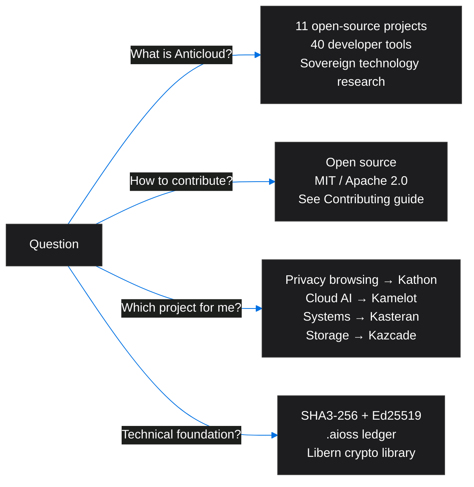

<!-- SEO -->
<meta name="description" content="Frequently asked questions about the Anticloud ecosystem — 16 questions covering projects, tools, cryptography, and community.">
<meta name="keywords" content="anticloud faq, frequently asked questions, ecosystem guide, getting started">

# Frequently Asked Questions

## Common Questions Overview

## Ecosystem Questions

<strong>What is Anticloud?</strong>

Anticloud is a **sovereign technology research ecosystem** comprising **11 open-source platform projects** and **40 developer tools**. The ecosystem builds privacy-first, cryptographically-verified technology spanning browsers, cloud infrastructure, programming languages, storage systems, and operating systems. [Learn more →](Home)

<strong>What does "sovereign technology" mean?</strong>

Technology that operates independently of centralized cloud providers, giving users full control over their data, computation, and identity. All Anticloud projects use cryptographic verification (SHA3-256 + Ed25519 + .aioss ledger) to ensure tamper-evident operations without reliance on third-party infrastructure.

<strong>How is this different from the Fandom Wiki?</strong>

The **GitHub Wiki** focuses on technical architecture, inter-project dependencies, and ecosystem mapping — complementing the main [Docusaurus documentation site](https://kleinnner.github.io/Anticloud/). The [Fandom Wiki](https://anticloud.fandom.com) serves as a community knowledge base for broader audiences.

<strong>Where can I find the full documentation?</strong>

The main documentation portal is at [kleinnner.github.io/Anticloud](https://kleinnner.github.io/Anticloud/), built with Docusaurus. It includes 55+ documentation pages, 40 tool docs, blog posts, and research paper references.

## Project Questions

<strong>How many projects are in the ecosystem?</strong>

**11 platform projects**: Kathon (browser), Kamelot (cloud runtime), Kasteran (language), Kazcade (VFS), API-OSS (API gateway), Inte11ect (AI gateway), aioss-format (ledger), Libern (crypto), Anticode (IDE), Sovereign-OS (OS), MFSO (search oracle). See [Projects](Projects) for full details.

<strong>Which project should I start with?</strong>

Choose by interest:
- **Privacy browsing** → [Kathon](Kathon) — vision-LLM ad blocking, per-tab VPN
- **Cloud/AI orchestration** → [Kamelot](Kamelot) or [Inte11ect](Inte11ect)
- **Systems programming** → [Kasteran](Kasteran) — rune-based language
- **Storage** → [Kazcade](Kazcade) — vector file system
- **API development** → [API-OSS](API-OSS) — WASM sandbox gateway
- **Identity/security** → [MFSO](MFSO) — multi-factor sign-on

<strong>What are the project statuses?</strong>

| Status | Meaning | Projects |
|--------|---------|----------|
|  | Production-ready | API-OSS, aioss-format, Libern |
|  | Feature-complete, testing | Kathon |
|  | Active development | Kasteran, Kamelot, Inte11ect, Anticode |
|  | Research phase | Kazcade, MFSO, Sovereign-OS |

<strong>How do projects relate to each other?</strong>

All projects share a common cryptographic foundation (Libern → SHA3-256, Ed25519). Higher-level projects depend on lower-level ones — e.g., Kathon uses Kazcade for storage and Libern for crypto. See [Architecture](Architecture) for the full dependency graph.

## Technical Questions

<strong>What is the cryptographic foundation?</strong>

A three-layer stack:
1. **SHA3-256** — Cryptographic hashing for integrity verification
2. **Ed25519** — Digital signatures for authenticity and non-repudiation
3. **.aioss ledger format** — Tamper-evident chain of proof-of-usefulness records

All provided by the [Libern](Libern) cryptographic library.

<strong>What programming languages are used?</strong>

| Language | Projects |
|----------|----------|
| **Rust** | Kathon, Kasteran, Kazcade, Kamelot, Libern, MFSO |
| **TypeScript** | Anticode, API-OSS (portal), Inte11ect (desktop) |
| **Go** | Inte11ect (core) |
| **Python** | Sovereign-OS (tools), API-OSS (research) |
| **Kasteran** | Self-hosted systems language |

<strong>What protocols do projects use to communicate?</strong>

- **REST/HTTP** — API-OSS ↔ external services
- **gRPC + WebSocket** — API-OSS ↔ Inte11ect (streaming)
- **CRDT over P2P** — Kathon ↔ Kazcade (distributed state)
- **LSP + MCP** — Anticode ↔ Kathon (AI-assisted coding)
- **Native FFI** — Kasteran ↔ Libern (crypto primitives)

<strong>What is the .aioss ledger format?</strong>

A dual-format cryptographic ledger format using SHA3-256 hash chaining and Ed25519 state proofs. It supports memory-mapped IO for high performance, SQLite event store integration, and post-quantum migration. Used for tamper-evident audit trails across the ecosystem. [Learn more →](aioss-format)

## Community Questions

<strong>How can I contribute?</strong>

See the [Contributing](Contributing) guide. All projects are open source (MIT / Apache 2.0). You can submit issues, fork repositories, open pull requests, or join discussions on GitHub.

<strong>Where is the community?</strong>

The ecosystem spans multiple platforms: [GitHub](https://github.com/kleinnner/Anticloud) (code & issues), [LinkedIn](https://linkedin.com/in/kleinner) (professional), [DEV.to](https://dev.to/kleinner) (articles), [Bluesky](https://bsky.app/profile/kleinner.bsky.social) (updates). See [Ecosystem](Ecosystem) for all platforms.

<strong>What research has been published?</strong>

Research papers are published on [Zenodo](https://zenodo.org/search?q=anticloud) and [Harvard Dataverse](https://dataverse.harvard.edu/dataverse/anticloud), covering cryptographic verification, sovereign computing, AI-native architectures, and privacy-preserving systems.

<strong>Is there a development roadmap?</strong>

Yes — see the [Roadmap](Roadmap) page for the quarter-by-quarter release timeline through 2027.

---

> 📖 **Full docs**: [Docusaurus Intro](https://kleinnner.github.io/Anticloud/docs/intro) · [Home](Home) · [Getting-Started](Getting-Started) · [Projects](Projects) · [Contributing](Contributing) · [Ecosystem](Ecosystem)
