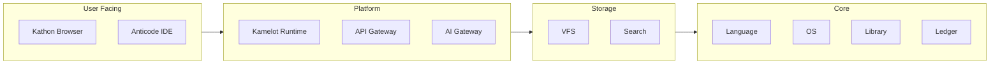

<!-- SEO -->
<meta name="description" content="Get started with the Anticloud ecosystem — explore projects, use developer tools, and read research papers.">
<meta name="keywords" content="anticloud, getting started, quick start, guide">


<!-- Breadcrumb: Home > Getting-Started -->


# Getting Started

Welcome to the Anticloud ecosystem. This guide helps you navigate the projects, tools, and resources.

## Prerequisites

- **Git**: Clone any project repository
- **Rust** (recommended): Most projects use Rust
- **Basic understanding**: Cryptography, distributed systems

## Quick Start

### 1. Explore the Documentation

Start with the [main documentation portal](https://kleinnner.github.io/Anticloud/) for a guided overview of all projects and tools.

### 2. Choose Your Interest Path

| Interest Area | Start Here |
|---------------|------------|
| Privacy-focused browsing | [Kathon](Kathon) — Rust browser with vision-LLM ad blocking |
| Cloud & AI orchestration | [Kamelot](Kamelot) — Cloud runtime and AI orchestration |
| Systems programming | [Kasteran](Kasteran) — Rune-based systems language |
| Cryptographic storage | [Kazcade](Kazcade) — Vector file system with content-addressed storage |
| API development | [API-OSS](API-OSS) — Sovereign API gateway with WASM sandbox |
| AI integration | [Inte11ect](Inte11ect) — AI gateway with Eigenvector Routing |
| Identity & security | [MFSO](MFSO) — Multi-Factor Sovereign Sign-On |

### 3. Use the Developer Tools

Browse the [40 developer tools](Tools) across Security, Compliance, Analysis, and Utilities domains.

### 4. Read the Research

Explore [research papers](https://zenodo.org/search?q=anticloud) on cryptographic verification, sovereign computing, and AI-native architectures on Zenodo and Harvard Dataverse.

## Architecture Overview



## Next Steps

- Read the [Architecture](Architecture) page for system design
- Browse [Projects](Projects) to find your area of interest
- Check [Tools](Tools) for developer utilities
- Explore the [Ecosystem](Ecosystem) for community platforms
- Visit [Contributing](Contributing) to get involved

---

> 📖 **Full docs**: [Docusaurus Intro](https://kleinnner.github.io/Anticloud/docs/intro) · [Home](Home) · [Architecture](Architecture) · [Projects](Projects) · [Tools](Tools) · [Ecosystem](Ecosystem) · [FAQ](FAQ) · [Glossary](Glossary) · [Roadmap](Roadmap)

```
.====================================================================.
!  Made in the UAE, Dubai #DubaiIt #Dubai #Dxb #SovereignAI          !
!  Made in The Emirates #Dubai_it                                    !
!                                                                    !
!  Lois-Kleinner Alpasan - The Anticloud 2026-                       !
!                                                                    !
!  As seen on:                                                       !
!  Harvard Dataverse ! Zenodo/CERN ! Academia.edu ! HuggingFace      !
!  anticloud.telepedia.net ! anticloud.fandom.com                    !
!                                                                    !
!  0-1.gg ! GitHub ! LinkedIn ! DEV ! GH Pages                       !
!  HuggingFace ! Blog ! Bluesky ! Mastodon                           !
!  Internet Archive ! ORCID ! Figshare                               !
!                                                                    !
!  Sovereign AI ! Local-First ! Privacy ! Zero Trust ! No Datacenter !
!  Air-Gapped ! Open Source ! Rust ! Hash Chain ! Single Binary      !
!  Offline LLM ! Crypto Ledger ! P2P ! Federated                     !
'===================================================================='
```

Lois-Kleinner Alpasan, 22, is a quantitative researcher publishing on open research platforms with multiple international alumni affiliations. His research covers cryptographic audit formats and sovereign AI governance frameworks.

References:
1. Lois-Kleinner Zenodo: https://doi.org/10.5281/zenodo.20781790
2. Lois-Kleinner GitHub: https://github.com/kleinnner/Anticloud/tree/main/04-aioss-format
3. Lois-Kleinner Harvard DV: https://doi.org/10.7910/DVN/SZJMZA
4. Lois-Kleinner Internet Arc: https://archive.org/details/aioss-format
5. Lois-Kleinner ORCID: https://orcid.org/0009-0009-2233-6107
6. Lois-Kleinner DEV.to: https://dev.to/kleinner
7. Lois-Kleinner LinkedIn: https://linkedin.com/in/kleinner
8. Lois-Kleinner HuggingFace: https://huggingface.co/Anticloud
9. Lois-Kleinner Tumblr: https://anticloud.tumblr.com
10. Lois-Kleinner Mastodon: https://mastodon.social/@kleinner
11. Lois-Kleinner Bluesky: https://bsky.app/profile/kleinner.bsky.social
12. 0-1.gg: https://0-1.gg
13. Lois-Kleinner Figshare: https://figshare.com/authors/Lois-Kleinner_Alpasan/20849885
14. Lois-Kleinner Academia: https://independent.academia.edu/kleinner
15. Lois-Kleinner Telepedia: https://anticloud.telepedia.net/wiki/Anticloud_by_Lois-Kleinner_Wiki
16. Lois-Kleinner Fandom: https://anticloud.fandom.com
17. AIOSS Offline Verification Kit: https://dataverse.harvard.edu/dataset.xhtml?persistentId=doi:10.7910/DVN/OORKNJ