<!-- SEO -->
<meta name="description" content="Get started with the Anticloud ecosystem — explore projects, use developer tools, and read research papers.">
<meta name="keywords" content="anticloud, getting started, quick start, guide">
<meta property="og:title" content="Getting Started with Anticloud">
<meta property="og:description" content="Get started with the Anticloud ecosystem — explore projects, use developer tools, and read research papers.">
<meta property="og:image" content="https://kleinnner.github.io/Anticloud/img/og-image.png">
<meta property="og:type" content="website">
<meta name="twitter:card" content="summary_large_image">
<meta name="twitter:title" content="Getting Started with Anticloud">
<meta name="twitter:description" content="Get started with the Anticloud ecosystem.">
<link rel="canonical" href="https://github.com/kleinnner/Anticloud/wiki/Getting-Started">

<!-- Breadcrumb: Home > Getting-Started -->

# Getting Started

Welcome to the Anticloud ecosystem. This guide helps you navigate the projects, tools, and resources.

## Prerequisites

- **Git**: Clone any project repository
- **Rust** (recommended): Most projects use Rust
- **Basic understanding**: Cryptography, distributed systems

## Quick Start

### 1. Explore the Documentation

Start with the [main documentation portal](https://kleinnner.github.io/Anticloud/) for a guided overview of all projects and tools.

### 2. Choose Your Interest Path

| Interest Area | Start Here |
|---------------|------------|
| Privacy-focused browsing | [Kathon](Kathon) — Rust browser with vision-LLM ad blocking |
| Cloud & AI orchestration | [Kamelot](Kamelot) — Cloud runtime and AI orchestration |
| Systems programming | [Kasteran](Kasteran) — Rune-based systems language |
| Cryptographic storage | [Kazcade](Kazcade) — Vector file system with content-addressed storage |
| API development | [API-OSS](API-OSS) — Sovereign API gateway with WASM sandbox |
| AI integration | [Inte11ect](Inte11ect) — AI gateway with Eigenvector Routing |
| Identity & security | [MFSO](MFSO) — Multi-Factor Sovereign Sign-On |

### 3. Use the Developer Tools

Browse the [40 developer tools](Tools) across Security, Compliance, Analysis, and Utilities domains.

### 4. Read the Research

Explore [research papers](https://zenodo.org/search?q=anticloud) on cryptographic verification, sovereign computing, and AI-native architectures on Zenodo and Harvard Dataverse.

## Architecture Overview

```mermaid
%%{init: { 'theme': 'base', 'themeVariables': { 'primaryColor': '#1d1d1f', 'primaryTextColor': '#fff', 'primaryBorderColor': '#333', 'lineColor': '#0071e3', 'tertiaryColor': '#f5f5f7' } }}%%
flowchart LR
    subgraph User[User Facing]
        KATHON[Kathon Browser]
        ANTICODE[Anticode IDE]
    end
    subgraph Platform[Platform]
        KAMELOT[Kamelot Runtime]
        APIOSS[API Gateway]
        INTE11ECT[AI Gateway]
    end
    subgraph Storage[Storage]
        KAZCADE[VFS]
        MFSO[Search]
    end
    subgraph Core[Core]
        KASTERAN[Language]
        SOVEREIGNOS[OS]
        LIBERN[Library]
        AIOSS[Ledger]
    end
    User --> Platform
    Platform --> Storage
    Storage --> Core
```

## Next Steps

- Read the [Architecture](Architecture) page for system design
- Browse [Projects](Projects) to find your area of interest
- Check [Tools](Tools) for developer utilities
- Explore the [Ecosystem](Ecosystem) for community platforms
- Visit [Contributing](Contributing) to get involved

---

> 📖 **Full docs**: [Docusaurus Intro](https://kleinnner.github.io/Anticloud/docs/intro) · [Home](Home) · [Architecture](Architecture) · [Projects](Projects) · [Tools](Tools) · [Ecosystem](Ecosystem) · [FAQ](FAQ) · [Glossary](Glossary) · [Roadmap](Roadmap)
