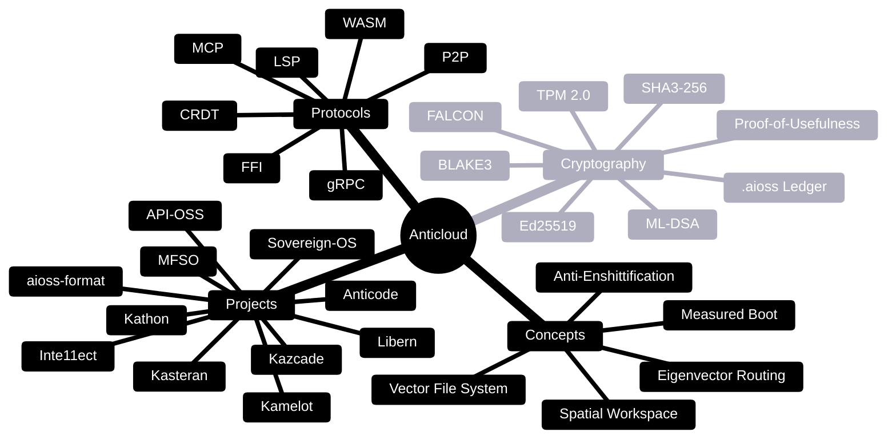

<!-- SEO -->
<meta name="description" content="Anticloud ecosystem glossary — 35+ technical terms covering projects, cryptographic primitives, protocols, and architecture concepts.">
<meta name="keywords" content="anticloud glossary, terminology, cryptographic terms, protocol glossary, technical terms">
<meta property="og:title" content="Anticloud Glossary">
<meta property="og:description" content="35+ technical terms covering Anticloud projects, cryptographic primitives, protocols, and architecture concepts.">
<meta property="og:image" content="https://kleinnner.github.io/Anticloud/img/og-image.png">
<meta property="og:type" content="website">
<meta name="twitter:card" content="summary_large_image">
<meta name="twitter:title" content="Anticloud Glossary">
<meta name="twitter:description" content="35+ technical terms covering the Anticloud ecosystem.">
<link rel="canonical" href="https://github.com/kleinnner/Anticloud/wiki/Glossary">

# Glossary

## Term Map

## Projects

| Term | Definition | Category | Related |
|------|------------|----------|---------|
| **Anticloud** | Sovereign technology research ecosystem comprising 11 open-source projects and 40 developer tools | Ecosystem | All projects |
| **Kathon** | Cryptographic browser with vision-LLM ad blocking (94.3% precision), CRDT P2P sync, spatial workspace, and per-tab VPN | Project | Kazcade, Libern, Anticode |
| **Kamelot** | Cloud runtime & AI orchestration platform for deploying and managing distributed services | Project | API-OSS, Kazcade |
| **Kasteran** | Rune-based systems language with linear capability types, self-hosted compiler, and Cranelift JIT/WASM/C backends | Project | Libern |
| **Kazcade** | Vector file system using 1536-dim dense embeddings stored in CRDT-synced content-addressed blocks | Project | Kasteran, Kathon, MFSO |
| **API-OSS** | Sovereign API gateway with WASM sandbox, multi-agent deliberation councils, and contradiction detection | Project | Kamelot, Inte11ect |
| **Inte11ect** | AI gateway with Eigenvector Routing, GOD-11 deterministic orchestrator, and 72 modular AI capabilities | Project | API-OSS |
| **aioss-format** | Dual-format cryptographic ledger with SHA3-256 hash chaining and Ed25519 state proofs | Project | Libern, Kathon |
| **Libern** | Cryptographic library providing Ed25519 digital signatures, SHA3-256 hashing, and post-quantum migration support | Project | Kasteran, Kathon, aioss-format |
| **Anticode** | Terminal-native AI-native IDE with fully local LLMs, MCP protocol agent system, and cryptographic audit trail | Project | Kathon |
| **Sovereign-OS** | Arch Linux-based privacy-first OS with .aioss ledger daemon, TPM attestation, and measured boot | Project | Kasteran, aioss-format |
| **MFSO** | Multi-Factor Search Oracle using Shamir secret sharing and BIP39 entropy analysis for identity verification | Project | Kazcade |

## Cryptography

| Term | Definition | Category | Related |
|------|------------|----------|---------|
| **SHA3-256** | Cryptographic hash function (Keccak-based, FIPS 202) — 256-bit output, used for integrity verification across all Anticloud projects | Cryptography | Libern, aioss-format |
| **Ed25519** | Edwards-curve Digital Signature Algorithm (255-bit curve) — high-speed signatures with deterministic nonces | Cryptography | Libern, aioss-format |
| **BLAKE3** | Parallel cryptographic hash function — used in Kazcade for content-addressed block integrity | Cryptography | Kazcade |
| **.aioss Ledger** | Tamper-evident cryptographic ledger format combining SHA3-256 hash chains with Ed25519 state proofs | Cryptography | aioss-format, Kathon, Sovereign-OS |
| **Proof-of-Usefulness** | Consensus mechanism where participants prove computational work produced valuable results (vs. wasteful PoW) | Cryptography | aioss-format |
| **TPM 2.0** | Trusted Platform Module 2.0 — hardware security chip for measured boot and key storage | Cryptography | Sovereign-OS |
| **ML-DSA** | Module-Lattice-Based Digital Signature Algorithm (FIPS 204) — post-quantum signature candidate | Cryptography | Libern (roadmap) |
| **FALCON** | Fast-Fourier Lattice-based Compact Signatures over NTRU — post-quantum signature candidate | Cryptography | Libern (roadmap) |

## Protocols

| Term | Definition | Category | Related |
|------|------------|----------|---------|
| **CRDT** | Conflict-free Replicated Data Type — data structure that converges across distributed peers without central coordination | Protocol | Kathon, Kazcade |
| **P2P** | Peer-to-peer network — direct communication between nodes without centralized servers | Protocol | Kathon, Kazcade |
| **MCP** | Model Context Protocol — standardized protocol for AI model interaction and tool use | Protocol | Anticode, Kathon |
| **LSP** | Language Server Protocol — standardized protocol for editor-agnostic language intelligence | Protocol | Anticode, Kasteran |
| **gRPC** | High-performance RPC framework using Protocol Buffers and HTTP/2 streaming | Protocol | API-OSS, Inte11ect |
| **WASM** | WebAssembly — portable binary instruction format for sandboxed execution | Protocol | API-OSS, Kasteran |
| **FFI** | Foreign Function Interface — mechanism for one language to call functions written in another | Protocol | Kasteran, Libern |

## Concepts

| Term | Definition | Category | Related |
|------|------------|----------|---------|
| **Anti-Enshittification Engine** | System that prevents platform degradation by monitoring and enforcing cryptographic proofs of fair behavior | Concept | Kathon |
| **Spatial Workspace** | 2D canvas-based browser tab organization replacing traditional linear tab bars | Concept | Kathon |
| **Eigenvector Routing** | AI model routing algorithm that uses eigenvector centrality to select optimal model for each query | Concept | Inte11ect |
| **Measured Boot** | Secure boot process where each stage measures the next before execution, recording measurements in TPM | Concept | Sovereign-OS |
| **Vector File System** | File system using dense vector embeddings (1536-dim) for semantic content-addressable storage | Concept | Kazcade |
| **Rune Language** | Visual/symbolic programming syntax in Kasteran using rune-like glyphs for type and control flow | Concept | Kasteran |
| **GOD-11** | GOD-11 deterministic orchestrator — rule-based AI orchestration system for predictable multi-model execution | Concept | Inte11ect |

---

> 📖 **Full docs**: [Docusaurus Intro](https://kleinnner.github.io/Anticloud/docs/intro) · [Home](Home) · [Architecture](Architecture) · [Projects](Projects) · [Protocol-Spec](Protocol-Spec) · [Security](Security)
