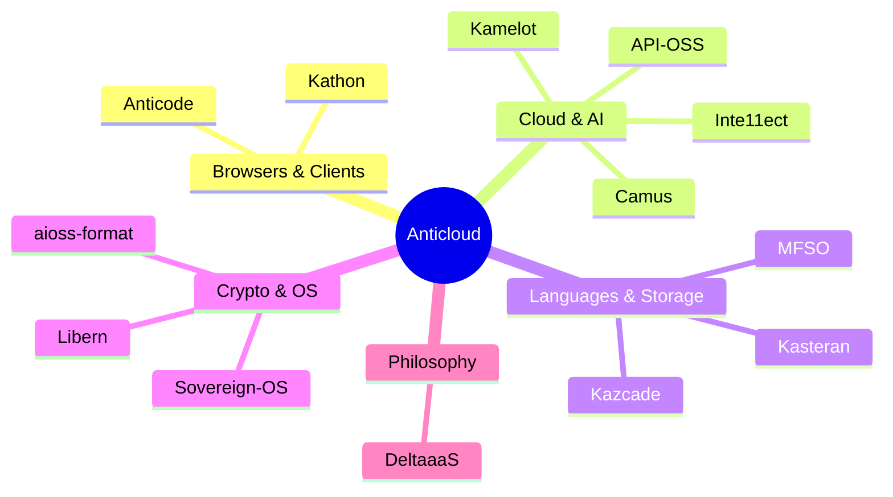
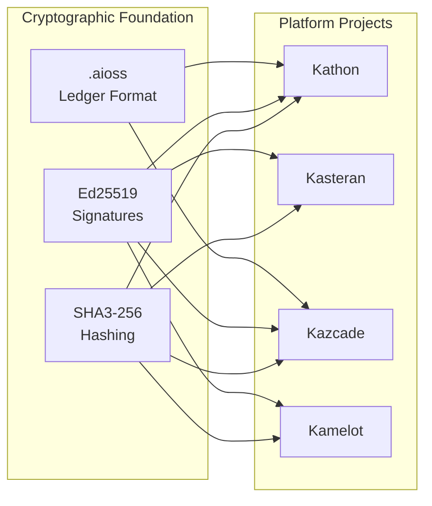

<!-- SEO -->
<meta name="description" content="Anticloud ecosystem wiki — 11 open-source projects building sovereign, privacy-first, cryptographically-verified technology. 40 developer tools across 4 domains.">
<meta name="keywords" content="anticloud, wiki, sovereign technology, cryptography, open source, kathon, kamelot, kasteran">

<!-- Breadcrumb: Home -->

---

# Anticloud Wiki

Welcome to the Anticloud ecosystem wiki — a unified knowledge base for **13 open-source projects** and **40 developer tools** building sovereign, privacy-first, cryptographically-verified technology.

## Ecosystem Overview

## Project Status Legend

| Badge | Meaning |
|-------|---------|
|  | Production-ready |
|  | Feature-complete, testing |
|  | Active development |
|  | Research phase |

## Cryptographic Foundation

All Anticloud projects share a common cryptographic layer:

## Quick Links

| Section | Description |
|---------|-------------|
| [Architecture](Architecture) | System architecture, cluster graphs, data flow |
| [Projects](Projects) | All 13 platform projects with status badges |
| [Kathon](Kathon) | Cryptographic browser with vision-LLM ad blocking |
| [Kamelot](Kamelot) | Cloud runtime & AI orchestration |
| [Kasteran](Kasteran) | Rune-based systems language |
| [Kazcade](Kazcade) | Vector file system |
| [API-OSS](API-OSS) | Sovereign API gateway |
| [Inte11ect](Inte11ect) | AI gateway & model router |
| [Camus](Camus) | Terminal-native vision-language AI shell |
| [ΔaaS](DeltaaaS) | Post-cloud superposition computing manifesto |
| [aioss-format](aioss-format) | Proof-of-usefulness ledger |
| [Libern](Libern) | Cryptographic library |
| [Anticode](Anticode) | AI-native IDE |
| [Sovereign-OS](Sovereign-OS) | Privacy-first OS |
| [MFSO](MFSO) | Multi-Factor Search Oracle |
| [Tools](Tools) | 40 developer tools across 4 domains |
| [Ecosystem](Ecosystem) | All platforms, profiles, and research repos |
| [Getting Started](Getting-Started) | Quick start guide and first steps |
| [Contributing](Contributing) | How to contribute to the ecosystem |
| [Roadmap](Roadmap) | Development timeline through 2027 |
| [FAQ](FAQ) | Frequently asked questions |
| [Glossary](Glossary) | Technical terms and definitions |
| [Security](Security) | Threat model and cryptographic guarantees |
| [Protocol Spec](Protocol-Spec) | Inter-project protocol specifications |
| [Performance](Performance) | Benchmarks and performance data |

## Stats

- **13** Platform Projects
- **40** Developer Tools
- **4** Domains: Security, Compliance, Analysis, Utilities
- **1** Cryptographic Foundation: SHA3-256 + Ed25519 + .aioss
- **6** External Platforms: GitHub, LinkedIn, DEV, Hugging Face, WordPress, Fandom

---

> 📖 **Full documentation**: [Docusaurus Portal](https://kleinnner.github.io/Anticloud/) · [GitHub Repository](https://github.com/kleinnner/Anticloud) · [Fandom Wiki](https://anticloud.fandom.com) · [Architecture](Architecture) · [Projects](Projects) · [Ecosystem](Ecosystem) · [Roadmap](Roadmap) · [Glossary](Glossary)
