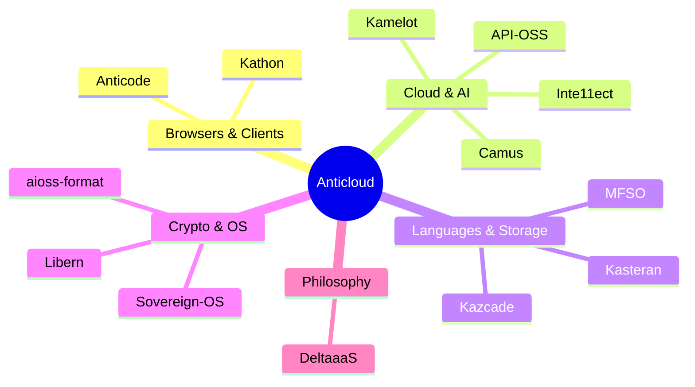
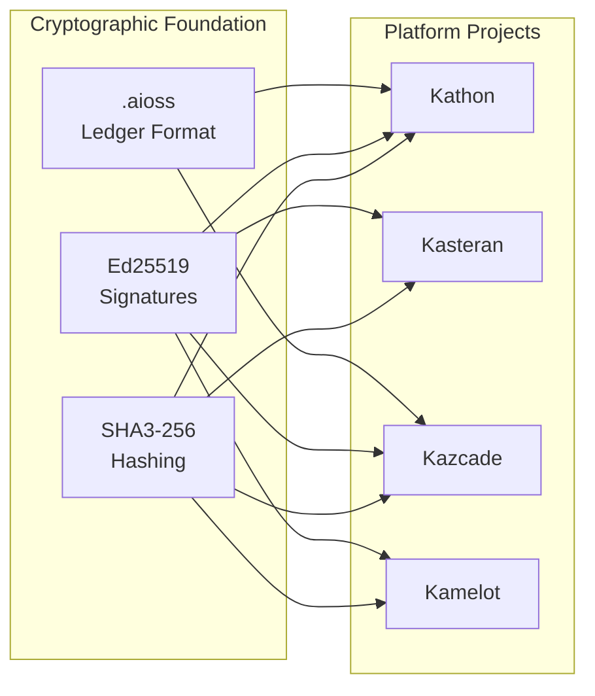

<!-- SEO -->
<meta name="description" content="Anticloud ecosystem wiki — 11 open-source projects building sovereign, privacy-first, cryptographically-verified technology. 40 developer tools across 4 domains.">
<meta name="keywords" content="anticloud, wiki, sovereign technology, cryptography, open source, kathon, kamelot, kasteran">


<!-- Breadcrumb: Home -->


[](https://dataverse.harvard.edu/dataverse/anticloud)
[](https://zenodo.org/search?q=anticloud)
[](https://huggingface.co/Anticloud)
[](https://figshare.com/authors/Lois-Kleinner_Alpasan/20849885)
[](https://independent.academia.edu/kleinner)
[](https://anticloud.telepedia.net)
[](https://anticloud.fandom.com)

---

# Anticloud Wiki

Welcome to the Anticloud ecosystem wiki — a unified knowledge base for **13 open-source projects** and **40 developer tools** building sovereign, privacy-first, cryptographically-verified technology.

## Ecosystem Overview



## Project Status Legend

| Badge | Meaning |
|-------|---------|
|  | Production-ready |
|  | Feature-complete, testing |
|  | Active development |
|  | Research phase |

## Cryptographic Foundation

All Anticloud projects share a common cryptographic layer:



## Quick Links

| Section | Description |
|---------|-------------|
| [Architecture](Architecture) | System architecture, cluster graphs, data flow |
| [Projects](Projects) | All 13 platform projects with status badges |
| [Kathon](Kathon) | Cryptographic browser with vision-LLM ad blocking |
| [Kamelot](Kamelot) | Cloud runtime & AI orchestration |
| [Kasteran](Kasteran) | Rune-based systems language |
| [Kazcade](Kazcade) | Vector file system |
| [API-OSS](API-OSS) | Sovereign API gateway |
| [Inte11ect](Inte11ect) | AI gateway & model router |
| [Camus](Camus) | Terminal-native vision-language AI shell |
| [ΔaaS](DeltaaaS) | Post-cloud superposition computing manifesto |
| [aioss-format](aioss-format) | Proof-of-usefulness ledger |
| [Libern](Libern) | Cryptographic library |
| [Anticode](Anticode) | AI-native IDE |
| [Sovereign-OS](Sovereign-OS) | Privacy-first OS |
| [MFSO](MFSO) | Multi-Factor Search Oracle |
| [Tools](Tools) | 40 developer tools across 4 domains |
| [Ecosystem](Ecosystem) | All platforms, profiles, and research repos |
| [Getting Started](Getting-Started) | Quick start guide and first steps |
| [Contributing](Contributing) | How to contribute to the ecosystem |
| [Roadmap](Roadmap) | Development timeline through 2027 |
| [FAQ](FAQ) | Frequently asked questions |
| [Glossary](Glossary) | Technical terms and definitions |
| [Security](Security) | Threat model and cryptographic guarantees |
| [Protocol Spec](Protocol-Spec) | Inter-project protocol specifications |
| [Performance](Performance) | Benchmarks and performance data |

## Stats

- **13** Platform Projects
- **40** Developer Tools
- **4** Domains: Security, Compliance, Analysis, Utilities
- **1** Cryptographic Foundation: SHA3-256 + Ed25519 + .aioss
- **6** External Platforms: GitHub, LinkedIn, DEV, Hugging Face, WordPress, Fandom

---

> 📖 **Full documentation**: [Docusaurus Portal](https://kleinnner.github.io/Anticloud/) · [GitHub Repository](https://github.com/kleinnner/Anticloud) · [Fandom Wiki](https://anticloud.fandom.com) · [Architecture](Architecture) · [Projects](Projects) · [Ecosystem](Ecosystem) · [Roadmap](Roadmap) · [Glossary](Glossary)

```
.====================================================================.
!  Made in the UAE, Dubai #DubaiIt #Dubai #Dxb #SovereignAI          !
!  Made in The Emirates #Dubai_it                                    !
!                                                                    !
!  Lois-Kleinner Alpasan - The Anticloud 2026-                       !
!                                                                    !
!  As seen on:                                                       !
!  Harvard Dataverse ! Zenodo/CERN ! Academia.edu ! HuggingFace      !
!  anticloud.telepedia.net ! anticloud.fandom.com                    !
!                                                                    !
!  0-1.gg ! GitHub ! LinkedIn ! DEV ! GH Pages                       !
!  HuggingFace ! Blog ! Bluesky ! Mastodon                           !
!  Internet Archive ! ORCID ! Figshare                               !
!                                                                    !
!  Sovereign AI ! Local-First ! Privacy ! Zero Trust ! No Datacenter !
!  Air-Gapped ! Open Source ! Rust ! Hash Chain ! Single Binary      !
!  Offline LLM ! Crypto Ledger ! P2P ! Federated                     !
'===================================================================='
```

Lois-Kleinner Alpasan, 22, has served executive roles spanning technology, operations, finance, and product across 20+ organizations. His cross-functional work combines architecture, business, and AI strategy.

References:
1. Lois-Kleinner Zenodo: https://doi.org/10.5281/zenodo.20781790
2. Lois-Kleinner GitHub: https://github.com/kleinnner/Anticloud/tree/main/04-aioss-format
3. Lois-Kleinner Harvard DV: https://doi.org/10.7910/DVN/KFK12Y
4. Lois-Kleinner Internet Arc: https://archive.org/details/aioss-format
5. Lois-Kleinner ORCID: https://orcid.org/0009-0009-2233-6107
6. Lois-Kleinner DEV.to: https://dev.to/kleinner
7. Lois-Kleinner LinkedIn: https://linkedin.com/in/kleinner
8. Lois-Kleinner HuggingFace: https://huggingface.co/Anticloud
9. Lois-Kleinner Tumblr: https://anticloud.tumblr.com
10. Lois-Kleinner Mastodon: https://mastodon.social/@kleinner
11. Lois-Kleinner Bluesky: https://bsky.app/profile/kleinner.bsky.social
12. 0-1.gg: https://0-1.gg
13. Lois-Kleinner Figshare: https://figshare.com/authors/Lois-Kleinner_Alpasan/20849885
14. Lois-Kleinner Academia: https://independent.academia.edu/kleinner
15. Lois-Kleinner Telepedia: https://anticloud.telepedia.net
16. Lois-Kleinner Fandom: https://anticloud.fandom.com