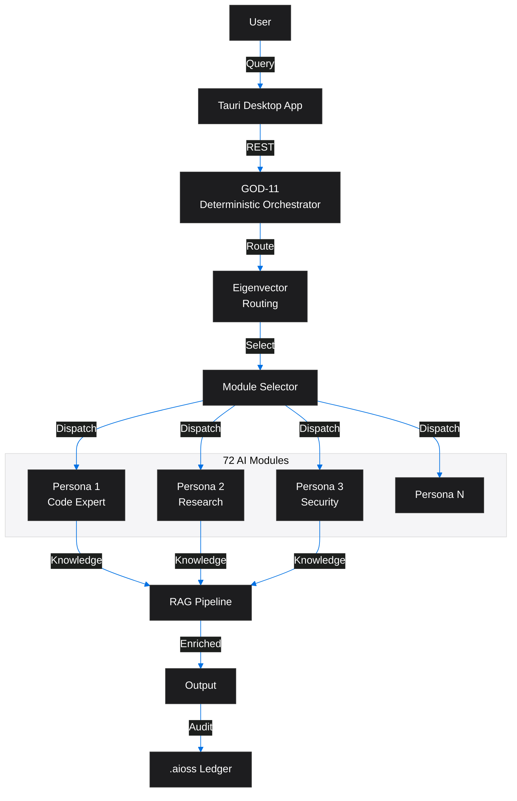
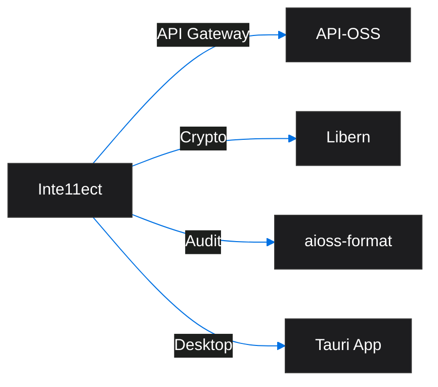
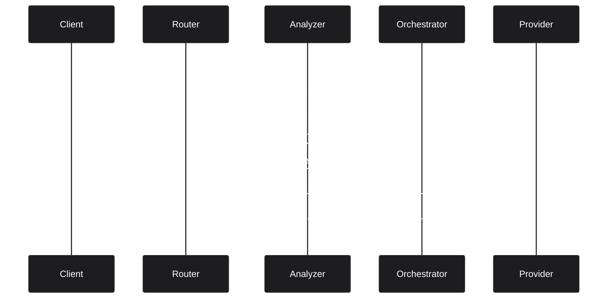

<!-- SEO -->
<meta name="description" content="Inte11ect — modular AI platform with 72 modules, Eigenvector Routing, GOD-11 deterministic orchestrator, domain-specific AI personas, RAG pipeline, Tauri desktop app.">
<meta name="keywords" content="inte11ect, AI gateway, model routing, LLM proxy, AI caching, prompt management">

<meta property="og:title" content="Inte11ect — Anticloud Wiki">
<meta property="og:description" content="Inte11ect — modular AI platform with 72 modules, Eigenvector Routing, GOD-11 deterministic orchestrator, domain-specific AI personas, RAG pipeline, Tauri desktop app.">
<meta property="og:image" content="https://kleinnner.github.io/Anticloud/img/og-image.png">
<meta property="og:type" content="website">
<meta name="twitter:card" content="summary_large_image">
<meta name="twitter:title" content="Inte11ect">
<meta name="twitter:description" content="Inte11ect — modular AI platform with 72 modules, Eigenvector Routing, GOD-11 deterministic orchestrator, domain-specific AI personas, RAG pipeline, Tauri desktop app.">
<link rel="canonical" href="https://github.com/kleinnner/Anticloud/wiki/Inte11ect">

<!-- Breadcrumb: Home > Projects > Inte11ect -->

# Inte11ect

Modular AI Platform with 72 modules, Eigenvector Routing, GOD-11 deterministic orchestrator, domain-specific AI personas, RAG pipeline, and Tauri desktop application.

## Quick Facts

| Attribute | Value |
|-----------|-------|
| **Status** |  |
| **Category** | Cloud & AI |
| **Language** | Go |
| **Source** | [`11-inte11ect/`](https://github.com/kleinnner/Anticloud/tree/main/11-inte11ect) |
| **Dependencies** | API-OSS, Libern |

## Orchestrator Architecture

## Relationship Graph

## AI Inference Routing

## Key Features

- **72 AI Modules**: Domain-specific personas for code, research, security, and more
- **Eigenvector Routing**: Smart request routing based on semantic similarity
- **GOD-11 Orchestrator**: Deterministic multi-agent coordination
- **RAG Pipeline**: Retrieval-Augmented Generation with vector search
- **Tauri Desktop App**: Native cross-platform desktop client
- **Audit Trail**: All AI interactions cryptographically logged

## Related Projects

| Project | Relationship | Protocol |
|---------|-------------|----------|
| [API-OSS](API-OSS) | API gateway — REST interface for service orchestration | REST |
| [Libern](Libern) | Cryptographic dependency — provides Ed25519, SHA3-256 | FFI |
| [Kamelot](Kamelot) | Runtime — AI model deployment | gRPC |

---

> 📖 **Full docs**: [Docusaurus Inte11ect](https://kleinnner.github.io/Anticloud/docs/projects/inte11ect) · [Home](Home) · [Projects](Projects) · [Architecture](Architecture) · [Ecosystem](Ecosystem) · [Roadmap](Roadmap) · [Glossary](Glossary) · [Protocol-Spec](Protocol-Spec)
